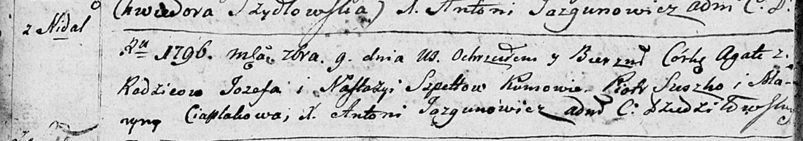
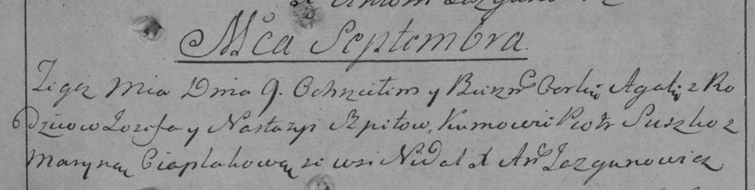

**Шпет Настасья (Szpetowa Nastazija)**

9 сентября 1796 г -- крещение дочери Агаты (НИАБ 136-13-894, лист 30об,
№80/1796-р (ориг)), (РГИА 823-2-18, лист 257, №47/1796-р (коп)).

**НИАБ 136-13-894:** Лист 30-об. **Метрическая запись №80/1796-р
(ориг).**

Дедиловичская Покровская церковь. 9 сентября 1796 года. Метрическая
запись о крещении.

Spetowna Agata -- дочь родителей с деревни Недаль.

Spet Jozef -- отец.

Spetowa Nastazija -- мать.

Suszko Piotr -- кум.

Ciaplakowa Maryna - кума.

Jazgunowicz Antoni -- ксёндз.

**РГИА 823-2-18:** Лист 257. **Метрическая запись №47/1796-р (коп).**

Дедиловичская Покровская церковь. 9 сентября 1796 года. Метрическая
запись о крещении.

Szpetowna Agata -- дочь родителей с деревни Недаль.

Szpet Jozef -- отец.

Szpetowa Nastazyia -- мать.

Suszko Piotr -- кум.

Ciaplakowa Maryna -- кума.

Jazgunowicz Antoni -- ксёндз.
