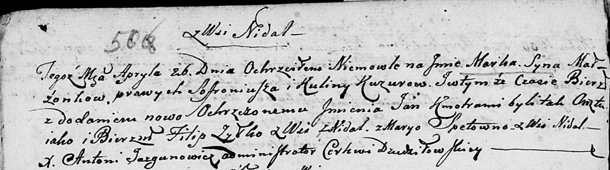

**Шпет Мария (Szpetowa, Szpetowna Maryia)**

26 сентября 1801 г -- крестная мать у Яна Бенедыкта, сына Кузур Соврония
и Кулины с деревни Недаль (НИАБ 136-13-894, лист 44, №22/1801-р (ориг)).

26 апреля 1803 г -- крестная мать Марка Яна, сына Кузуров Софрония и
Кулины с деревни Недаль (НИАБ 136-13-894, лист 50об, №17/1803-р (ориг)).

**НИАБ 136-13-894:** Лист 44. **Метрическая запись №22/1801-р (ориг).**

{width="6.496527777777778in"
height="1.773487532808399in"}

Дедиловичская Покровская церковь. 26 сентября 1801 года. Метрическая
запись о крещении.

Kuzura Jan Benedykt -- сын родителей с деревни Недаль.

Kuzura Sowroniusz -- отец.

Kuzurowa Kulina -- мать.

Koszczyc Alexander -- кум, с деревни Недаль.

Szpetowa Maryia -- кума, с деревни Недаль.

Jazgunowicz Antoni -- ксёндз.

**НИАБ 136-13-894:** Лист 50об. **Метрическая запись №17/1803-р
(ориг).**

{width="6.496527777777778in"
height="1.8251159230096239in"}

Дедиловичская Покровская церковь. 26 апреля 1803 года. Метрическая
запись о крещении.

Kuzura Marka Jan -- сын родителей с деревни Недаль.

Kuzura Sofroniusz -- отец.

Kuzurowa Kulina -- мать.

Żylko Filip -- кум, с деревни Недаль.

Szpetowna Marya -- кума, с деревни Недаль.

Jazgunowicz Antoni -- ксёндз.
