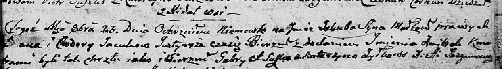
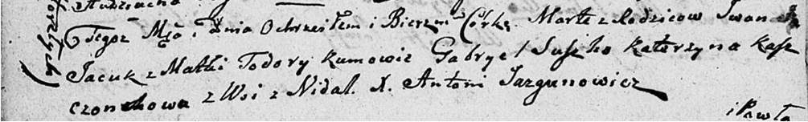

**Яцук Иван (Jacuk Jwan)**

23 октября 1804 г -- крещение сына Якуба Змитрока (НИАБ 136-13-894, лист
55, №48/1804-р (ориг)).

7 июня 1810 г -- крещение дочери Марты (НИАБ 136-13-894, лист 77об,
№20/1810-р (ориг)).

**НИАБ 136-13-894:** Лист 55. **Метрическая запись №48/1804-р (ориг).**

Дедиловичская Покровская церковь. 23 октября 1804 года. Метрическая
запись о крещении.

Jacuk Jakub Zmitrok -- сын родителей с деревни Недаль.

Jacuk \[Jwan\] -- отец.

Jacukowa Chodora -- мать.

Suszko Gabriel -- кум.

Żyłkowa Katerzyna -- кума.

Jazgunowicz Antoni -- ксёндз.

**НИАБ 136-13-894:** Лист 77об. **Метрическая запись №20/1810-р
(ориг).**

Дедиловичская Покровская церковь. 7 июня 1810 года. Метрическая запись о
крещении.

Jacukowna Marta -- дочь родителей из деревни Недаль.

Jacuk Jwan -- отец.

Jacukowa Todora -- мать.

Suszko Gabryel -- кум.

Kaszczonkowa Katerzyna -- кума.

Jazgunowicz Antoni -- ксёндз.
