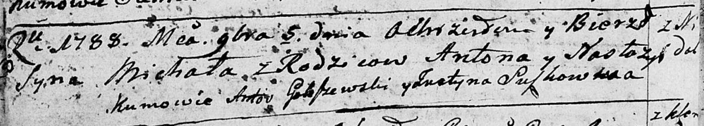

**Настасья (Nastazyia)**

5 ноября 1788 г -- крещение сына Михала (НИАБ 136-13-894, лист 5об,
№63/1788-р (ориг)).

**НИАБ 136-13-894:** Лист 5об. **Метрическая запись №63/1788-р (ориг).**

Дедиловичская Покровская церковь. 5 ноября 1788 года. Метрическая запись
о крещении.

Michał -- сын родителей с деревни Недаль.

Anton-- отец.

Nastazyia -- мать.

Gołoszewski Antoś - кум.

Suszkowicha Justyna - кума.

Jazgunowicz Antoniusz -- ксёндз.
