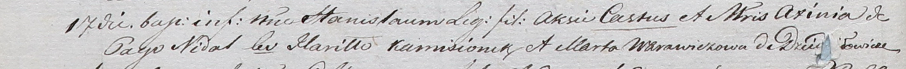

**Аксиня (Axinia)**

17 ноября 1801 г -- крещение сына Станислава (НИАБ 937-4-32, лист 4об,
№24/1801-р).

**НИАБ 937-4-32:** Лист 4об. **Метрическая запись №24/1801-р.**

Дедиловичский костел Наисвятейшего Сердца Иисуса. 17 ноября 1801 года.
Метрическая запись о крещении.

Stanisław -- сын родителей с деревни Недаль.

Castus -- отец.

Axinia -- мать.

Kamisionek Hariłło -- крестный отец, с деревни Дедиловичи.

Warawiczowa Marta -- крестная мать, с деревни Дедиловичи.

Linhart Hyacinthus -- ксёндз.
