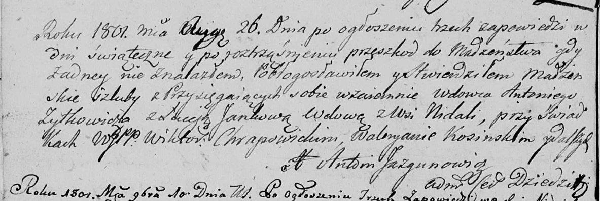

**Жилко Луцея (Żyłkowiczowa Luceja)**

26 августа 1801 г -- венчание с вдовцом Антоном Жилко с деревни Недаль
(НИАБ 136-13-920, лист 7об, №4/1801-б (ориг)).

**НИАБ 136-13-920:** Лист 7об. **Метрическая запись №4/1801-б (ориг).**

{width="6.496527777777778in"
height="2.180483377077865in"}

Дедиловичская Покровская церковь. 26 августа 1801 года. Метрическая
запись о венчании.

Żylkowicz Antoni -- жених, вдовец с деревни Недаль.

Luceja Jankowa -- невеста, вдова с деревни Недаль.

Chrapowicki Wiktor, WJP -- свидетель, шляхтич.

Kosinski Waleryan -- свидетель.

Jazgunowicz Antoni -- ксёндз.
