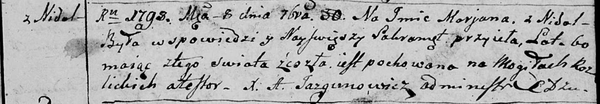

**Марьяна (Marjana)**

30 сентября 1798 г -- отпевание, умерла в возрасте 60 лет (родилась
около 1738 г) (НИАБ 136-13-919, лист 8, №15/1798-у (ориг)).

**НИАБ 136-13-919:** Лист 8. **Метрическая запись №15/1798-у (ориг).**

{width="6.496527777777778in"
height="1.1354166666666667in"}

Дедиловичская Покровская церковь. 30 сентября 1798 года. Метрическая
запись об отпевании.

Marjana -- умершая, 60 лет, с деревни Недаль, похоронена на кладбище
деревни Разлитье.

Jazgunowicz Antoni -- ксёндз.
