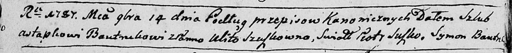
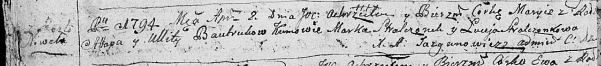
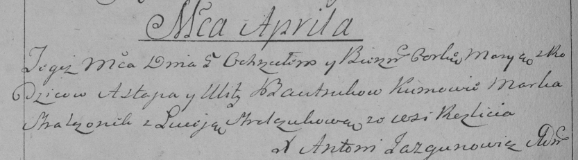
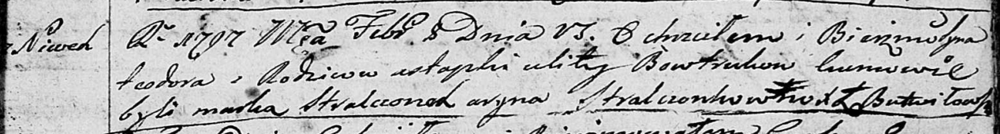
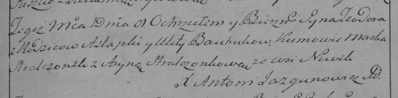
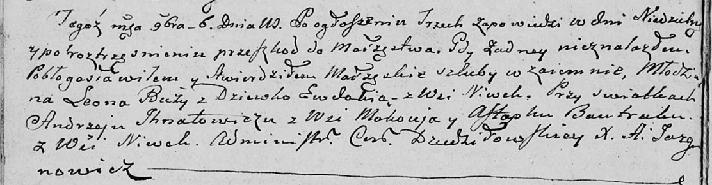
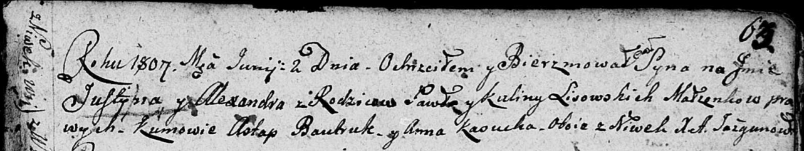
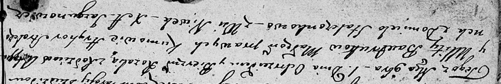

**Бавтрук Астап (Bautruk, Bowtruk Astap, Astapka)**

14 ноября 1787 г -- венчание с Улитой Сушко (НИАБ 136-13-894, лист 66об,
№14/1787-б (ориг)).

2 апреля 1794 г -- крещение дочери Марыи (НИАБ 136-13-894, лист 21об,
№17/1794-р (ориг)), (РГИА 823-2-18, лист 249об, №11/1794-р (коп)).

8 февраля 1797 г -- крещение сына Тодора (НИАБ 136-13-894, лист 32,
№11/1797-р (ориг)), (РГИА 823-2-18, лист 259, №10/1797-р (коп)).

6 ноября 1802 г -- свидетель венчания молодого Андрея Бузы с деревни
Маковье с девкой Евдокией с деревни Нивки (НИАБ 136-13-920, лист 8об,
№7/1802-б (ориг)).

2 июня 1807 г -- крестный отец у Юстыния Александра, сына Лисичёнков
Павла и Кулины с деревни Нивки (НИАБ 136-13-894, лист 63, №28/1807-р
(ориг)).

1 ноября 1808 г -- крещение дочери Розалии (НИАБ 136-13-894, лист 72об,
№41/1808-р (ориг)).

**НИАБ 136-13-894:** Лист 66об. **Метрическая запись №14/1787-б
(ориг).**

Дедиловичская Покровская церковь. 14 ноября 1787 года. Метрическая
запись о венчании.

Bautruk Astapka -- жених с деревни \[Нивки\].

Suszkowna Ulita -- невеста.

Suszko Piotr -- свидетель.

Bautruk Symon -- свидетель.

Jazgunowicz Antoni -- ксёндз.

**НИАБ 136-13-894:** Лист 21-об. **Метрическая запись №17/1794-р
(ориг).**

Дедиловичская Покровская церковь. 2 апреля 1794 года. Метрическая запись
о крещении.

Bautrukowna Maryia -- дочь родителей с деревни Нивки.

Bautruk Astap -- отец.

Bautrukowa Ullita -- мать.

Stralczonek Marko - кум.

Stralczonkowa Luceja - кума.

Jazgunowicz Antoni -- ксёндз.

**РГИА 823-2-18:** Лист 249об. **Метрическая запись №11/1794-р (коп).**

Дедиловичская Покровская церковь. \[2\] апреля 1794 года. Метрическая
запись о крещении.

Bautrukowna Marya -- дочь родителей с деревни \[Нивки\].

Bautruk Astap -- отец.

Bautrukowa Ulita -- мать.

Stralczonek Marko -- кум.

Stralczukowa Łuceja -- кума.

Jazgunowicz Antoni -- ксёндз.

**НИАБ 136-13-894:** Лист 32. **Метрическая запись №11/1797-р (ориг).**

Дедиловичская Покровская церковь. 8 февраля 1797 года. Метрическая
запись о крещении.

Bowtruk Teodor -- сын родителей с деревни Нивки.

Bowtruk Astapka -- отец.

Bowtrukowa Ulita -- мать.

Stralczonek Marka - кум.

Stralczonkowa Aryna - кума.

Butwilowski Łukasz -- ксёндз Мстижской церкви.

**РГИА 823-2-18:** Лист 259. **Метрическая запись №10/1797-р (коп).**

Дедиловичская Покровская церковь. 8 февраля 1797 года. Метрическая
запись о крещении.

Bautruk Teodor -- сын родителей с деревни Нивки.

Bautruk Astapka -- отец.

Bautrukowa Ulita -- мать.

Stralczonek Marko -- кум.

Stralczonkowa Aryna -- кума.

Jazgunowicz Antoni -- ксёндз.

**НИАБ 136-13-920:** Лист 8об. **Метрическая запись №7/1802-б (ориг).**

Дедиловичская Покровская церковь. 6 ноября 1802 года. Метрическая запись
о венчании.

Buza Leon -- жених, молодой.

Ewdokia -- невеста, девка, с деревни Нивки.

Jhnatowicz Andrzey -- свидетель, с деревни Маковье.

Bautruk Astapka -- свидетель, с деревни Нивки.

Jazgunowicz Antoni -- ксёндз.

**НИАБ 136-13-894:** Лист 63. **Метрическая запись №28/1807-р (ориг).**

Дедиловичская Покровская церковь. 2 июня 1807 года. Метрическая запись о
крещении.

Lisowski Justynij Alexander -- сын родителей с деревни Нивки.

Lisowski Paweł -- отец.

Lisowska Kulina -- мать.

Bautruk Astap -- кум, с деревня Нивки.

Kasucka Anna -- кума, деревня Нивки.

Jazgunowicz Antoni -- ксёндз.

**НИАБ 136-13-894:** Лист 72об. **Метрическая запись №41/1808-р
(ориг).**

Дедиловичская Покровская церковь. 1 ноября 1808 года. Метрическая запись
о крещении.

Bautrukowna Rozalia -- дочь родителей с деревни Нивки.

Bautruk Astap -- отец.

Bautrukowa Ullita -- мать.

Stralczonek Hryhor -- кум.

Stralczonkowa Domicela -- кума.

Jazgunowicz Antoni -- ксёндз.
