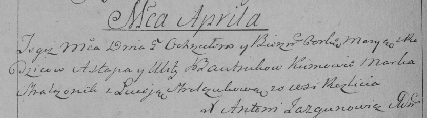

**Бавтрук (Сушко) Улита (Bautrukowa, Bowtrukowa Ullita, Ulita z
Suszkow)**

14 ноября 1787 г -- венчание с Астапом Бавтруком (НИАБ 136-13-894, лист
66об, №14/1787-б (ориг)).

2 апреля 1794 г -- крещение дочери Марыи (НИАБ 136-13-894, лист 21об,
№17/1794-р (ориг)), (РГИА 823-2-18, лист 249об, №11/1794-р (коп)).

8 февраля 1797 г -- крещение сына Тодора (НИАБ 136-13-894, лист 32,
№11/1797-р (ориг)), (РГИА 823-2-18, лист 259, №10/1797-р (коп)).

8 мая 1799 г -- крестный отец Миколая Крыштофа, сына Лисичёнков Василя и
Прузыны с деревни Нивки (НИАБ 136-13-938, лист 242, №21/1799-р (коп)).

1 ноября 1808 г -- крещение дочери Розалии (НИАБ 136-13-894, лист 72об,
№41/1808-р (ориг)).

**НИАБ 136-13-894:** Лист 66об. **Метрическая запись №14/1787-б
(ориг).**

{width="6.496527777777778in"
height="0.6865977690288714in"}

Дедиловичская Покровская церковь. 14 ноября 1787 года. Метрическая
запись о венчании.

Bautruk Astapka -- жених с деревни \[Нивки\].

Suszkowna Ulita -- невеста.

Suszko Piotr -- свидетель.

Bautruk Symon -- свидетель.

Jazgunowicz Antoni -- ксёндз.

**НИАБ 136-13-894:** Лист 21-об. **Метрическая запись №17/1794-р
(ориг).**

{width="6.496527777777778in"
height="0.7254866579177602in"}

Дедиловичская Покровская церковь. 2 апреля 1794 года. Метрическая запись
о крещении.

Bautrukowna Maryia -- дочь родителей с деревни Нивки.

Bautruk Astap -- отец.

Bautrukowa Ullita -- мать.

Stralczonek Marko - кум.

Stralczonkowa Luceja - кума.

Jazgunowicz Antoni -- ксёндз.

**РГИА 823-2-18:** Лист 249об. **Метрическая запись №11/1794-р (коп).**

{width="6.496527777777778in"
height="1.801388888888889in"}

Дедиловичская Покровская церковь. \[2\] апреля 1794 года. Метрическая
запись о крещении.

Bautrukowna Marya -- дочь родителей с деревни \[Нивки\].

Bautruk Astap -- отец.

Bautrukowa Ulita -- мать.

Stralczonek Marko -- кум.

Stralczukowa Łuceja -- кума.

Jazgunowicz Antoni -- ксёндз.

**НИАБ 136-13-894:** Лист 32. **Метрическая запись №11/1797-р (ориг).**

{width="6.496527777777778in"
height="0.876350612423447in"}

Дедиловичская Покровская церковь. 8 февраля 1797 года. Метрическая
запись о крещении.

Bowtruk Teodor -- сын родителей с деревни Нивки.

Bowtruk Astapka -- отец.

Bowtrukowa Ulita -- мать.

Stralczonek Marka - кум.

Stralczonkowa Aryna - кума.

Butwilowski Łukasz -- ксёндз Мстижской церкви.

**РГИА 823-2-18:** Лист 259. **Метрическая запись №10/1797-р (коп).**

{width="6.496527777777778in"
height="1.60625in"}

Дедиловичская Покровская церковь. 8 февраля 1797 года. Метрическая
запись о крещении.

Bautruk Teodor -- сын родителей с деревни Нивки.

Bautruk Astapka -- отец.

Bautrukowa Ulita -- мать.

Stralczonek Marko -- кум.

Stralczonkowa Aryna -- кума.

Jazgunowicz Antoni -- ксёндз.

**НИАБ 136-13-938:** Лист 242. **Метрическая запись №21/1799-р (коп).**

(См. тж. НИАБ 136-13-894, лист 39, №22/1799-р (ориг); РГИА 823-2-18,
лист 270, №22/1799-р (коп))

{width="6.496527777777778in"
height="1.4083333333333334in"}

Дедиловичская Покровская церковь. 8 мая 1799 года. Метрическая запись о
крещении.

Lisowski Mikołay Krysztof -- сын родителей с деревни Нивки.

Lisowski Wasil -- отец.

Lisowska Pruzyna -- мать.

Bautruk Piotr -- кум, с деревни Нивки.

Bautrukowa Ulita - кума, с деревни Нивки.

Jazgunowicz Antoni -- ксёндз.

**НИАБ 136-13-894:** Лист 72об. **Метрическая запись №41/1808-р
(ориг).**

{width="6.496527777777778in"
height="1.0982884951881016in"}

Дедиловичская Покровская церковь. 1 ноября 1808 года. Метрическая запись
о крещении.

Bautrukowna Rozalia -- дочь родителей с деревни Нивки.

Bautruk Astap -- отец.

Bautrukowa Ullita -- мать.

Stralczonek Hryhor -- кум.

Stralczonkowa Domicela -- кума.

Jazgunowicz Antoni -- ксёндз.
