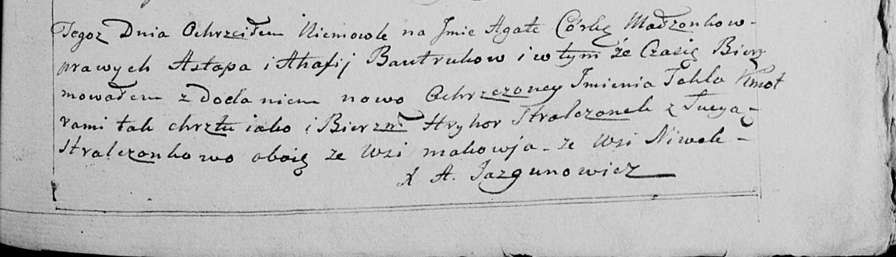

**Бавтрук Астафий (Bautruk Astafij)**

20 ноября 1799 г -- крещение дочери Агаты (НИАБ 136-13-894, лист 40,
№51/1799-р (ориг), РГИА 823-2-18, лист 273об, №50/1799-р (коп), НИАБ
136-13-938, лист 245, №46/1799-р (коп)).

**НИАБ 136-13-894:** Лист 40. **Метрическая запись №51/1799-р (ориг).**

{width="6.496527777777778in"
height="0.8113112423447069in"}

Дедиловичская Покровская церковь. 20 ноября 1799 года. Метрическая
запись о крещении.

Bautrukowna Agata -- дочь родителей с деревни Нивки.

Bautruk Astafij -- отец.

Bautrukowa Ahafija -- мать.

Stralczonek Hryhor -- кум, с деревни Маковье.

Stralczonkowa Luceja -- кума, с деревни Маковье.

Jazgunowicz Antoni -- ксёндз.

**РГИА 823-2-18:** Лист 273об. **Метрическая запись №50/1799-р (коп).**

{width="6.496527777777778in"
height="1.7222222222222223in"}

Дедиловичская Покровская церковь. 20 ноября 1799 года. Метрическая
запись о крещении.

Bautrukowna Agata -- дочь родителей с деревни Нивки.

Bautruk Astafi -- отец.

Bautrukowa Ahafija -- мать.

Stralczonek Hryhor -- кум, с деревни Маковье.

Stralczonkowa Luceja -- кума, с деревни Маковье.

Jazgunowicz Antoni -- ксёндз.

**НИАБ 136-13-938:** Лист 245. **Метрическая запись №46/1799-р (коп).**

(См. тж. НИАБ 136-13-894, лист 40, №51/1799-р (ориг); РГИА 823-2-18,
лист 273об, №50/1799-р (коп))

{width="6.496527777777778in"
height="1.8652777777777778in"}

Дедиловичская Покровская церковь. 6 ноября 1799 года. Метрическая запись
о крещении.

Bautrukowna Agata Tekla -- дочь родителей с деревни Нивки.

Bautruk Astap -- отец.

Bautrukowa Ahafia -- мать.

Stralczonek Hryhor -- кум, с деревни Маковье.

Stralczonkowa Lucya - кума, с деревни Маковье.

Jazgunowicz Antoni -- ксёндз.
