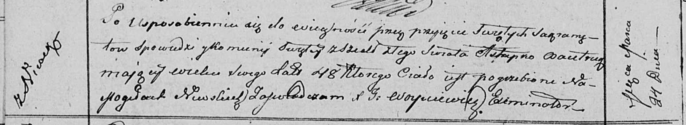

**Бавтрук Астапко (Bautruk Astapko)**

24 марта 1812 г -- отпевание, умер в возрасте 48 лет (родился около 1764
г) (НИАБ 136-13-919, лист 23об, №4/1812-у (ориг)).

**НИАБ 136-13-919:** Лист 23об. **Метрическая запись №4/1812-у (ориг).**

{width="6.496527777777778in"
height="1.1826388888888888in"}

Осовская униатская церковь. 24 марта 1812 года. Метрическая запись об
отпевании.

Bautruk Astapko -- умерший, 48 лет, с деревни Нивки, похоронен на
кладбище деревни Нивки.

Woyniewicz Tomasz -- ксёндз.
