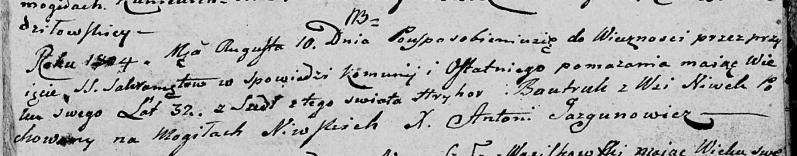

**Бавтрук Грыгор (Bautruk Hryhor)**

10 августа 1804 г -- отпевание, умер в возрасте 32 лет (родился около
1772 г) (НИАБ 136-13-919, лист 15, №5/1804-у (ориг)).

**НИАБ 136-13-919:** Лист 15. **Метрическая запись №5/1804-у (ориг).**

Дедиловичская Покровская церковь. 10 августа 1804 года. Метрическая
запись об отпевании.

Bautruk Hryhor -- умерший, 32 года, с деревни Нивки, похоронен на
кладбище деревни Нивки.

Jazgunowicz Antoni -- ксёндз.
