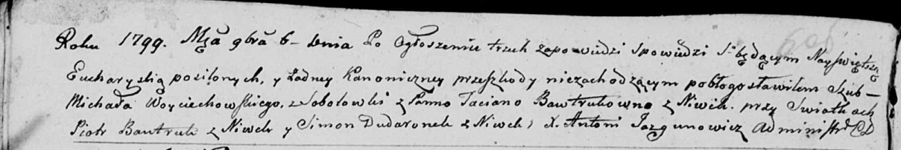

**Бавтрук Пётр (Bautruk Piotr)**

8 мая 1799 г -- крестный отец Миколая Крыштофа, сына Лисичёнков Василя и
Прузыны с деревни Нивки (НИАБ 136-13-938, лист 242, №21/1799-р (коп)).

6 ноября 1799 г -- свидетель венчания Войцеховского Михала с деревни
Соболевка с Бавтрук Татьяной с деревни Нивки (НИАБ 136-13-920, лист 6об,
№4/1799-б (ориг)).

**НИАБ 136-13-938:** Лист 242. **Метрическая запись №21/1799-р (коп).**

(См. тж. НИАБ 136-13-894, лист 39, №22/1799-р (ориг); РГИА 823-2-18,
лист 270, №22/1799-р (коп))

{width="6.496527777777778in"
height="1.4083333333333334in"}

Дедиловичская Покровская церковь. 8 мая 1799 года. Метрическая запись о
крещении.

Lisowski Mikołay Krysztof -- сын родителей с деревни Нивки.

Lisowski Wasil -- отец.

Lisowska Pruzyna -- мать.

Bautruk Piotr -- кум, с деревни Нивки.

Bautrukowa Ulita - кума, с деревни Нивки.

Jazgunowicz Antoni -- ксёндз.

**НИАБ 136-13-920:** Лист 6об. **Метрическая запись №4/1799-б (ориг).**

{width="6.496527777777778in"
height="1.0909120734908135in"}

Дедиловичская Покровская церковь. 6 ноября 1799 года. Метрическая запись
о венчании.

Woyciechowski Michał -- жених, деревня Соболевка.

Bautrukowna Taciana -- невеста, деревня Нивки.

Bautruk Piotr -- свидетель, деревня Нивки.

Dudaronek Simon -- свидетель, деревня Нивки.

Jazgunowicz Antoni -- ксёндз.
