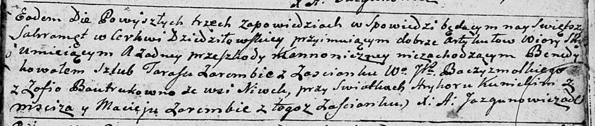

**Бавтрук (Заремба) София (Zaremba Zofia z Bautrukow)**

7 октября 1792 г -- венчание с Тарасом Зарембой с застенка Зарембы?
(НИАБ 136-13-894, лист 71, №14/1792-б (ориг)).

**НИАБ 136-13-894:** Лист 71. **Метрическая запись №14/1792-б (ориг).**

{width="6.496527777777778in"
height="1.3799004811898512in"}

Дедиловичская Покровская церковь. 7 октября 1792 года. Метрическая
запись о венчании.

Zaremba Taras -- жених, с застенка WJP Бачизмальского.

Bautrukowna Zofia -- невеста, с деревни Нивки.

Kunicki Hryhor -- свидетель, с деревни Мстиж.

Zaremba Maciey -- свидетель, с застенка WJP Бачизмальского.

Jazgunowicz Antoni -- ксёндз.
