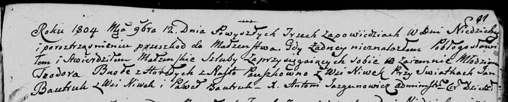

**Бавтрук Ян (Bautruk Jan)**

12 ноября 1804 г -- свидетель венчания молодого Тодора Бусло с деревни
Горелое с Настой Паушко с деревни Нивки (НИАБ 136-13-920, лист 11,
№11/1804-б (ориг)).

13 ноября 1804 г -- свидетель венчания Гаврыла Стрельчёнка с деревни
Мстиж с Зосей Бавтрук с деревни Нивки (НИАБ 136-13-920, лист 11,
№13/1804-б (ориг)).

15 мая 1817 г -- крещение сына Яна (НИАБ 136-13-894, лист 96об,
№34/1817-р (ориг)).

**НИАБ 136-13-920:** Лист 11. **Метрическая запись №13/1804-б (ориг).**

{width="6.496527777777778in"
height="1.6092136920384952in"}

Дедиловичская Покровская церковь. 13 ноября 1804 года. Метрическая
запись о венчании.

Stralczonek Hauryła -- жених, с деревни Мстиж.

Bautrukowna Zosia -- невеста, с деревни Нивки.

Stralczonek Naum -- свидетель, с деревни Маковье.

Bautruk Jan -- свидетель, с деревни Нивки.

Jazgunowicz Antoni -- ксёндз.

**НИАБ 136-13-920:** Лист 11. **Метрическая запись №11/1804-б (ориг).**

{width="6.496527777777778in"
height="1.3068153980752406in"}

Дедиловичская Покровская церковь. 12 ноября 1804 года. Метрическая
запись о венчании.

Busła Teodor -- жених, молодой, с деревни Горелое.

Pauszkowna Nasta -- невеста, с деревни Нивки.

Bautruk Jan -- свидетель, с деревни Нивки.

Bautruk Paweł -- свидетель.

Jazgunowicz Antoni -- ксёндз.
