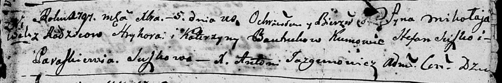

**Бавтрук Миколай Грыгоров (Bautruk Mikołay)**

5 декабря 1797 г -- крещение (НИАБ 136-13-894, лист 35, №67/1797-р
(ориг)), (РГИА 823-2-18, лист 261об, №48/1797-р (коп)).

**НИАБ 136-13-894:** Лист 35. **Метрическая запись №67/1797-р (ориг).**

Дедиловичская Покровская церковь. 5 декабря 1797 года. Метрическая
запись о крещении.

Bautruk Mikolay -- сын родителей с деревни Нивки.

Bautruk Hryhor -- отец.

Bautrukowa Katerzyna -- мать.

Suszko Stefan - кум.

Suszkowa Paraskiewia - кума.

Jazgunowicz Antoni -- ксёндз.

**РГИА 823-2-18:** Лист 261об. **Метрическая запись №48/1797-р (коп).**

Дедиловичская Покровская церковь. 5 декабря 1797 года. Метрическая
запись о крещении.

Bautruk Mikołay -- сын родителей с деревни Нивки.

Bautruk Hryhor -- отец.

Bautrukowa Katarzyna -- мать.

Suszko Stefan -- кум.

Suszkowa Praskowia -- кума.

Jazgunowicz Antoni -- ксёндз.
