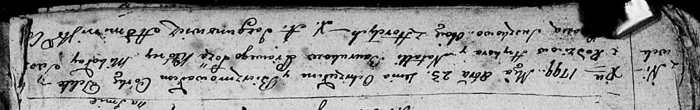
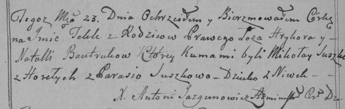

**Бавтрук Текля Грыгорова (Baurukowna Tekla)**

23 октября 1799 г -- крещение (НИАБ 136-13-894, лист 39об, №41/1799-р
(ориг), РГИА 823-2-18, лист 272об, №40/1799-р (коп), НИАБ 136-13-938,
лист 244об, №39/1799-р (коп)).

**НИАБ 136-13-894:** Лист 39об. **Метрическая запись №41/1799-р
(ориг).**

Дедиловичская Покровская церковь. 23 октября 1799 года. Метрическая
запись о крещении.

Baurukowna Tekla -- дочь родителей с деревни Нивки.

Bauruk Hryhor -- отец.

Bauruk Natalla -- мать.

\[Suszko\] Mikołay -- кум с деревни Горелое.

Suszkowa Parasia -- кума с деревни Горелое.

Jazgunowicz Antoni -- ксёндз.

**РГИА 823-2-18:** Лист 272об. **Метрическая запись №40/1799-р (коп).**

Дедиловичская Покровская церковь. 23 октября 1799 года. Метрическая
запись о крещении.

Bautrukowna Tekla -- дочь родителей с деревни Нивки.

Bautruk Hryhor -- отец.

Bautrukowa Natalla -- мать.

Suszko Mikołay -- кум, с деревни Горелое.

Suszkowa Parasia -- кума.

Jazgunowicz Antoni -- ксёндз.

**НИАБ 136-13-938:** Лист 244об. **Метрическая запись №39/1799-р
(коп).**

(См. тж. НИАБ 136-13-894, лист 39об, №41/1799-р (ориг); РГИА 823-2-18,
лист 272об, №40/1799-р (коп))

Дедиловичская Покровская церковь. 23 октября 1799 года. Метрическая
запись о крещении.

Bautrukowna Tekla Anna -- дочь родителей с деревни \[Нивки\].

Bautruk Hryhor -- отец.

Bautrukowa Natalla -- мать.

Suszko Mikołay -- кум, с деревня Горелое.

Suszkowa Parasia - кума, с деревня Горелое.

Jazgunowicz Antoni -- ксёндз.
