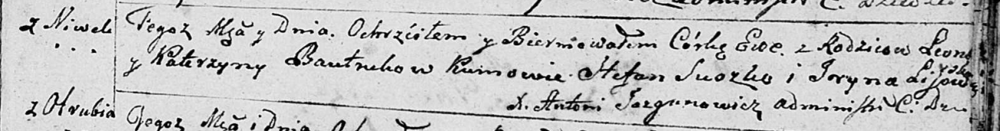
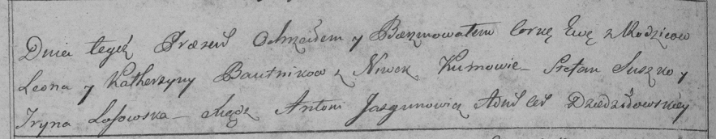

**Бавтрук Ева Леонова (Bautrukowna Ewa)**

27 декабря 1798 г -- крещение (НИАБ 136-13-894, лист 38, №65/1798-р
(ориг)), (РГИА 823-2-18, лист 267об, №66/1798-р (коп)).

**НИАБ 136-13-894:** Лист 38. **Метрическая запись №65/1798-р (ориг).**

Дедиловичская Покровская церковь. 27 декабря 1798 года. Метрическая
запись о крещении.

Bautrukowna Ewa -- дочь родителей с деревни Нивки.

Bautruk Leon -- отец.

Bautrukowa Katerzyna -- мать.

Suszko Stefan - кум.

Lisowska Jryna - кума.

Jazgunowicz Antoni -- ксёндз.

**РГИА 823-2-18:** Лист 267об. **Метрическая запись №66/1798-р (коп).**

Дедиловичская Покровская церковь. 27 декабря 1798 года. Метрическая
запись о крещении.

Bautrukowna Ewa -- дочь родителей с деревни Нивки.

Bautruk Leon -- отец.

Bautrukowa Katerzyna -- мать.

Suszko Stefan -- кум.

Lisowska Jryna -- кума.

Jazgunowicz Antoni -- ксёндз.
