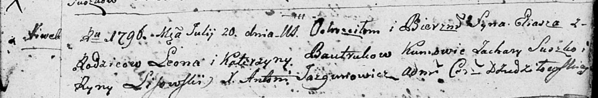
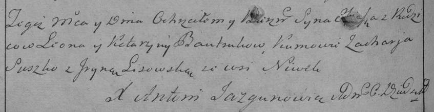

**Бавтрук Илья Леонов (Bautruk Eliasz)**

20 июля 1796 г -- крещение (НИАБ 136-13-894, лист 30, №70/1796-р
(ориг)), (РГИА 823-2-18, лист 256об, №40/1796-р (коп)).

**НИАБ 136-13-894:** Лист 30. **Метрическая запись №70/1796-р (ориг).**

Дедиловичская Покровская церковь. 20 июля 1796 года. Метрическая запись
о крещении.

Bautruk Eliasz -- сын родителей с деревни Нивки.

Bautruk Leon -- отец.

Bautrukowa Katerzyna -- мать.

Suszko Zachary - кум.

Lisowska Ryna - кума.

Jazgunowicz Antoni -- ксёндз.

**РГИА 823-2-18:** Лист 256об. **Метрическая запись №40/1796-р (коп).**

Дедиловичская Покровская церковь. 20 июля 1796 года. Метрическая запись
о крещении.

Bautruk Eliasz -- сын родителей с деревни Нивки.

Bautruk Leon -- отец.

Bautrukowa Katarzyna -- мать.

Suszko Zacharja -- кум.

Lisowska Jryna -- кума.

Jazgunowicz Antoni -- ксёндз.
