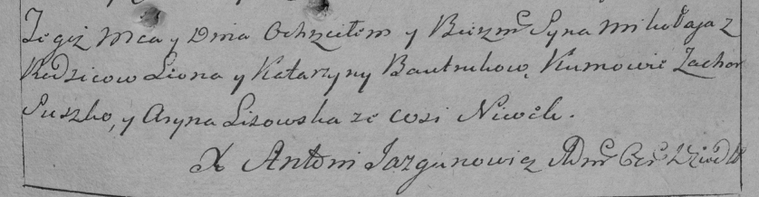

**Бавтрук Миколай Леонов (Bautruk Mikołay)**

8 мая 1793 г -- крещение (НИАБ 136-13-894, лист 19об, №39/1793-р
(ориг)), (РГИА 823-2-18, лист 247, №19/1793-р (коп)).

**НИАБ 136-13-894:** Лист 19-об. **Метрическая запись №39/1793-р
(ориг).**

{width="6.496527777777778in"
height="0.5343930446194226in"}

Дедиловичская Покровская церковь. 8 мая 1793 года. Метрическая запись о
крещении.

Bautruk Mikołay -- сын родителей с деревни Нивки.

Bautruk Leon -- отец.

Bautrukowa Katerzyna -- мать.

Szyszko Zachary - кум.

Lisowska Aryna - кума.

Jazgunowicz Antoni -- ксёндз.

**РГИА 823-2-18:** Лист 247. **Метрическая запись №19/1793-р (коп).**

{width="6.496527777777778in"
height="1.6902777777777778in"}

Дедиловичская Покровская церковь. 8 мая 1793 года. Метрическая запись о
крещении.

Bautruk Mikołay -- сын родителей с деревни Нивки.

Bautruk Leon -- отец.

Bautrukowa Katarzyna -- мать.

Suszko Zachar -- кум.

Lisowska Aryna -- кума.

Jazgunowicz Antoni -- ксёндз.
