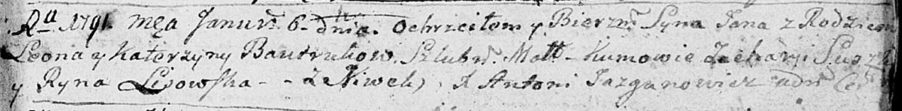

**Бавтрук Ян Леонов (Bautruk Jan)**

6 января 1791 г -- крещение (НИАБ 136-13-894, лист 12, №1/1791-р (ориг))
(РГИА 823-2-18, лист 241об, №1/1791-р (коп)).

**НИАБ 136-13-894:** Лист 12. **Метрическая запись №1/1791-р (ориг).**

Дедиловичская Покровская церковь. 6 января 1791 года. Метрическая запись
о крещении.

Bautruk Jan -- сын родителей с деревни Нивки.

Bautruk Leon -- отец.

Bautruk Katerzyna -- мать.

Suszko Zacharyi - кум.

Lisowska Ryna - кума.

Jazgunowicz Antoni -- ксёндз.

**РГИА 823-2-18:** Лист 241об. **Метрическая запись №1/1791-р (коп).**

Дедиловичская Покровская церковь. 6 января 1791 года. Метрическая запись
о крещении.

Bautruk Jan -- сын родителей с деревни Нивки.

Bautruk Leon -- отец.

Bautrukowa Katarzyna -- мать.

Suszko Zacharyasz -- кум.

Lisowska Jryna - кума.

Jazgunowicz Antoni -- ксёндз.
