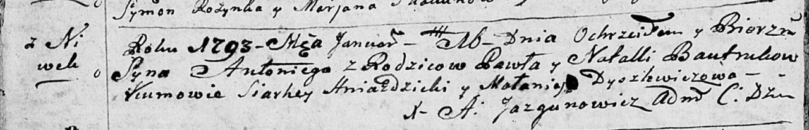

**Бавтрук Павел (Bautruk Paweł)**

16 января 1793 г -- крещение сына Антона (НИАБ 136-13-894, лист 18об,
№12/1793-р (ориг)).

**НИАБ 136-13-894:** Лист 18-об. **Метрическая запись №12/1793-р
(ориг).**

{width="6.496527777777778in"
height="1.0506824146981628in"}

Дедиловичская Покровская церковь. 16 января 1793 года. Метрическая
запись о крещении.

Bautruk Antoni -- сын родителей с деревни Нивки.

Bautruk Paweł -- отец.

Bautrukowa Natalla -- мать.

Hniazdzicki Siarhey - кум.

Dyszlewiczowa Małanija - кума.

Jazgunowicz Antoni -- ксёндз.
