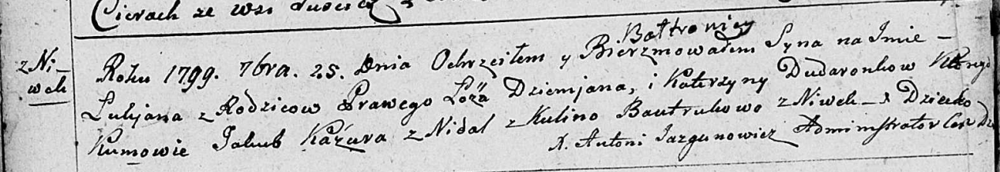

**Бавтрук Кулина (Bautrukowa Kulina)**

13 октября 1790 г -- крещение дочери Параски (НИАБ 136-13-894, лист
11об, №71/1790-р (ориг)).

19 ноября 1794 г -- крещение сына Филипа (НИАБ 136-13-894, лист 23об,
№55/1794-р (ориг)), (РГИА 823-2-18, лист 251, №39/1794-р (коп)).

25 сентября 1799 г -- крестная мать Лукьяна Балтромея, сына Дударёнков
Демьяна и Катерыны с деревни Нивки (НИАБ 136-13-894, лист 39об,
№37/1799-р (ориг)).

**НИАБ 136-13-894:** Лист 11об. **Метрическая запись №71/1790-р
(ориг).**

Дедиловичская Покровская церковь. 13 октября 1790 года. Метрическая
запись о крещении.

Bautrukowna Paraska -- дочь родителей с деревни Нивки.

Bautruk Piatruś -- отец.

Bautrukowa Kulina -- мать.

Pupuszka Jan - кум.

Kuryliwiczowa Anna - кума.

Jazgunowicz Antoni -- ксёндз.

**НИАБ 136-13-894:** Лист 23об. **Метрическая запись №55/1794-р
(ориг).**

Дедиловичская Покровская церковь. 19 ноября 1794 года. Метрическая
запись о крещении.

Bautruk Filip -- сын родителей с деревни Нивки.

Bautruk Piotr -- отец.

Bautrukowa Kulina -- мать.

Pupuszka Jan - кум.

Kuryliczowa Anna - кума.

Jazgunowicz Antoni -- ксёндз.

**РГИА 823-2-18:** Лист 251. **Метрическая запись №39/1794-р (коп).**

Дедиловичская Покровская церковь. 19 ноября 1794 года. Метрическая
запись о крещении.

Bautruk Filip -- сын родителей с деревни Нивки.

Bautruk Piotr -- отец.

Bautrukowa Kulina -- мать.

Pupuszka Jan -- кум.

Kuryłowiczowa Anna -- кума.

Jazgunowicz Antoni -- ксёндз.

**НИАБ 136-13-894:** Лист 39об. **Метрическая запись №37/1799-р
(ориг).**

Дедиловичская Покровская церковь. 25 сентября 1799 года. Метрическая
запись о крещении.

Dudaronek Łukjan Bałtromiey -- сын родителей с деревни Нивки.

Dudaronek Dziemjan -- отец.

Dudaronkowa Katerzyna -- мать.

Kazura Jakub -- кум с деревни Недаль.

Bautrukowa Kulina -- кума с деревни Нивки.

Jazgunowicz Antoni -- ксёндз.
