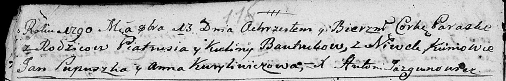
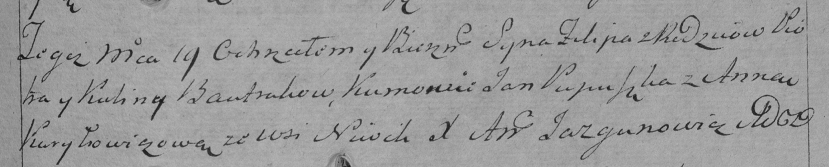

**Бавтрук Пётр (Bautruk Piotr, Piatruś)**

13 октября 1790 г -- крещение дочери Параски (НИАБ 136-13-894, лист
11об, №71/1790-р (ориг)).

19 ноября 1794 г -- крещение сына Филипа (НИАБ 136-13-894, лист 23об,
№55/1794-р (ориг)), (РГИА 823-2-18, лист 251, №39/1794-р (коп)).

2 января 1799 г -- возможно, крестный отец Иосифа, сына Яцуков Хведора и
Агафии с Нивок; см. тж Бавтрук Пётр (НИАБ 136-13-894, лист 38, №2/1798-р
(ориг), НИАБ 136-13-938, лист 240, №2/1799-р (коп), НИАБ 136-13-938,
лист 248, №4/1799-б (коп)).

8 мая 1802 г -- возможно, крестный отец Павла Яна, сына Яцуков Хведора и
Агафии с Нивок (НИАБ 136-13-894, лист 46об, №14/1802-р (ориг)).

**НИАБ 136-13-894:** Лист 11об. **Метрическая запись №71/1790-р
(ориг).**

Дедиловичская Покровская церковь. 13 октября 1790 года. Метрическая
запись о крещении.

Bautrukowna Paraska -- дочь родителей с деревни Нивки.

Bautruk Piatruś -- отец.

Bautrukowa Kulina -- мать.

Pupuszka Jan - кум.

Kuryliwiczowa Anna - кума.

Jazgunowicz Antoni -- ксёндз.

**НИАБ 136-13-894:** Лист 23об. **Метрическая запись №55/1794-р
(ориг).**

Дедиловичская Покровская церковь. 19 ноября 1794 года. Метрическая
запись о крещении.

Bautruk Filip -- сын родителей с деревни Нивки.

Bautruk Piotr -- отец.

Bautrukowa Kulina -- мать.

Pupuszka Jan - кум.

Kuryliczowa Anna - кума.

Jazgunowicz Antoni -- ксёндз.

**РГИА 823-2-18:** Лист 251. **Метрическая запись №39/1794-р (коп).**

Дедиловичская Покровская церковь. 19 ноября 1794 года. Метрическая
запись о крещении.

Bautruk Filip -- сын родителей с деревни Нивки.

Bautruk Piotr -- отец.

Bautrukowa Kulina -- мать.

Pupuszka Jan -- кум.

Kuryłowiczowa Anna -- кума.

Jazgunowicz Antoni -- ксёндз.

**НИАБ 136-13-894:** Лист 38. **Метрическая запись №2/1799-р (ориг).**

Дедиловичская Покровская церковь. 2 января 1799 года. Метрическая запись
о крещении.

Jacuk Jozef Piotr -- сын родителей с деревни Нивки.

Jacuk Chwiedor -- отец.

Jacukowa Ahafija -- мать.

Bautruk Piotr -- кум с деревни Нивки.

Lisowska Ryna -- кума с застенка Нивки.

Jazgunowicz Antoni -- ксёндз.

**НИАБ 136-13-938:** Лист 240. **Метрическая запись №2/1799-р (коп).**

(См. тж. НИАБ 136-13-894, лист 38, №2/1799-р (ориг); РГИА 823-2-18, лист
268, №2/1799-р (коп))

Дедиловичская Покровская церковь. 2 января 1799 года. Метрическая запись
о крещении.

Jacuk Jozef Piotr -- сын родителей с деревни Нивки.

Jacuk Chwiedor -- отец.

Jacukowa Ahafija -- мать.

Bautruk Piotr -- кум, с деревни Нивки.

Lisowska Jryna - кума, с деревни Нивки.

Jazgunowicz Antoni -- ксёндз.

**НИАБ 136-13-938:** Лист 248. **Метрическая запись №4/1799-б (коп).**

(См. тж. НИАБ 136-13-920, лист 6об, №4/1799-б (ориг))

Дедиловичская Покровская церковь. 6 ноября 1799 года. Метрическая запись
о венчании.

Woyciechowicz Michał -- жених, молодой, с деревни Соболевка.

Bautrukowna Taciana -- невеста, с деревни Нивки.

Bautruk Piotr -- свидетель, с деревни Нивки.

Dudaronek Symon -- свидетель, с деревни Нивки.

Jazgunowicz Antoni -- ксёндз.

**НИАБ 136-13-894:** Лист 46об. **Метрическая запись №14/1802-р
(ориг).**

Дедиловичская Покровская церковь. 8 мая 1802 года. Метрическая запись о
крещении.

Jacuk Paweł Jan -- сын родителей с деревни Нивки.

Jacuk Chwiedor -- отец.

Jacukowa Ahapa -- мать.

Bautruk Piotr -- кум, с деревни Нивки.

Lisowska Maryna -- кума.

Jazgunowicz Antoni -- ксёндз.
