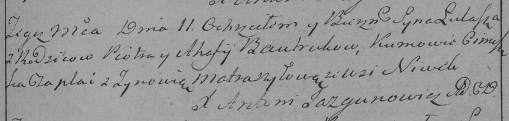

**Бавтрук Агапа (Bautrukowa Ahafija, Ahapa)**

27 августа 1788 г -- крещение сына Тадея (НИАБ 136-13-894, лист 5,
№45/1788-р (ориг)).

11 ноября 1791 г -- крещение сына Луки (НИАБ 136-13-894, лист 14,
№55/1791-р (ориг)), (РГИА 823-2-18, лист 243, №30/1791-р (коп)).

9 октября 1793 г -- крещение дочери Ксени (НИАБ 136-13-894, лист 20об,
№71/1793-р (ориг)).

**НИАБ 136-13-894:** Лист 5. **Метрическая запись №45/1788-р (ориг).**

{width="6.496527777777778in"
height="0.8093000874890639in"}

Дедиловичская Покровская церковь. 27 августа 1788 года. Метрическая
запись о крещении.

Bautruk Thadeusz -- сын родителей с деревни Нивки.

Bautruk Piatruś -- отец.

Bautrukowa Ahafija -- мать.

Ciaplak Cimoszka - кум.

Ciunczykowa? Zynowija - кума.

Jazgunowicz Antoni -- ксёндз.

**НИАБ 136-13-894:** Лист 14. **Метрическая запись №55/1791-р (ориг).**

{width="6.496527777777778in"
height="0.8046062992125984in"}

Дедиловичская Покровская церковь. 11 ноября 1791 года. Метрическая
запись о крещении.

Bautruk Łukasz -- сын родителей с деревни Нивки.

Bautruk Piotr -- отец.

Bautrukowa Ahafija -- мать.

Ciaplak Cimoszka - кум.

Szyłowa Zynowiia - кума.

Jazgunowicz Antoni -- ксёндз.

**РГИА 823-2-18:** Лист 243. **Метрическая запись №30/1791-р (коп).**

{width="6.496527777777778in"
height="1.5444444444444445in"}

Дедиловичская Покровская церковь. 11 ноября 1791 года. Метрическая
запись о крещении.

Bautruk Łukasz -- сын родителей с деревни Нивки.

Bautruk Piotr -- отец.

Bautrukowa Ahafija -- мать.

Czaplai \[Ciaplak\] Cimoszka -- кум.

Matraszyłowa Zynowia - кума.

Jazgunowicz Antoni -- ксёндз.

Лист 20-об. **Метрическая запись №71/1793-р (ориг).**

{width="6.496527777777778in"
height="0.6859273840769904in"}

Дедиловичская Покровская церковь. 9 октября 1793 года. Метрическая
запись о крещении.

Bautrukowna Xienia -- дочь родителей с деревни Нивки.

Bautruk Piotr -- отец.

Bautrukowa Ahapa-- мать.

Ciaplak Cimoszka - кум.

Matraszyłowa Hrypina - кума.

Jazgunowicz Antoni -- ксёндз.
