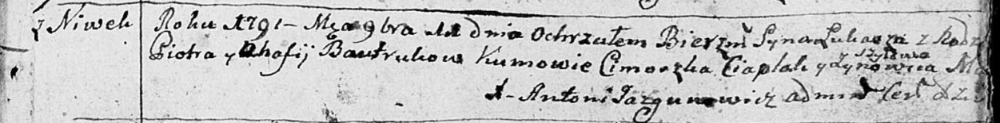

**Бавтрук Лука Пятрусёв (Bautruk Łukasz)**

11 ноября 1791 г -- крещение (НИАБ 136-13-894, лист 14, №55/1791-р
(ориг)), (РГИА 823-2-18, лист 243, №30/1791-р (коп)).

**НИАБ 136-13-894:** Лист 14. **Метрическая запись №55/1791-р (ориг).**

Дедиловичская Покровская церковь. 11 ноября 1791 года. Метрическая
запись о крещении.

Bautruk Łukasz -- сын родителей с деревни Нивки.

Bautruk Piotr -- отец.

Bautrukowa Ahafija -- мать.

Ciaplak Cimoszka - кум.

Szyłowa Zynowiia - кума.

Jazgunowicz Antoni -- ксёндз.

**РГИА 823-2-18:** Лист 243. **Метрическая запись №30/1791-р (коп).**

Дедиловичская Покровская церковь. 11 ноября 1791 года. Метрическая
запись о крещении.

Bautruk Łukasz -- сын родителей с деревни Нивки.

Bautruk Piotr -- отец.

Bautrukowa Ahafija -- мать.

Czaplai \[Ciaplak\] Cimoszka -- кум.

Matraszyłowa Zynowia - кума.

Jazgunowicz Antoni -- ксёндз.
