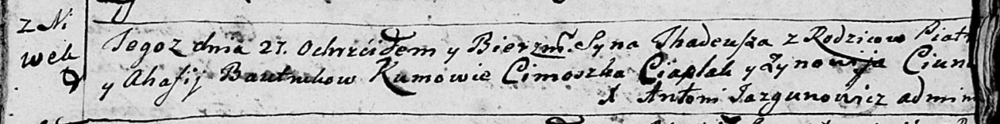
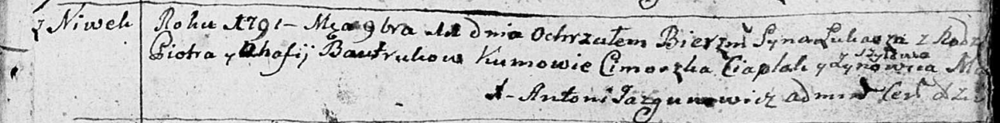
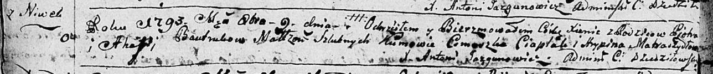
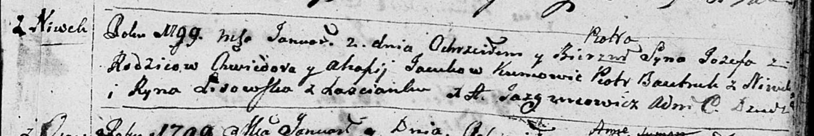
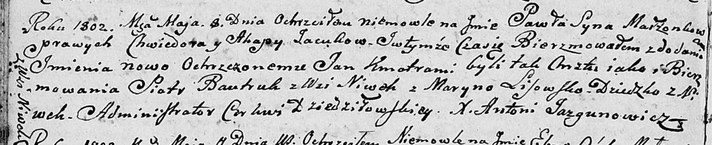

**Бавтрук Пятрусь (Bautruk Piatruś, Piotr)**

27 августа 1788 г -- крещение сына Тадея (НИАБ 136-13-894, лист 5,
№45/1788-р (ориг)).

11 ноября 1791 г -- крещение сына Луки (НИАБ 136-13-894, лист 14,
№55/1791-р (ориг)), (РГИА 823-2-18, лист 243, №30/1791-р (коп)).

9 октября 1793 г -- крещение дочери Ксени (НИАБ 136-13-894, лист 20об,
№71/1793-р (ориг)).

2 января 1799 г -- возможно, крестный отец Иосифа, сына Яцуков Хведора и
Агафии с Нивок (НИАБ 136-13-894, лист 38, №2/1798-р (ориг)).

8 мая 1802 г -- возможно, крестный отец Павла Яна, сына Яцуков Хведора и
Агафии с Нивок (НИАБ 136-13-894, лист 46об, №14/1802-р (ориг)).

**НИАБ 136-13-894:** Лист 5. **Метрическая запись №45/1788-р (ориг).**

Дедиловичская Покровская церковь. 27 августа 1788 года. Метрическая
запись о крещении.

Bautruk Thadeusz -- сын родителей с деревни Нивки.

Bautruk Piatruś -- отец.

Bautrukowa Ahafija -- мать.

Ciaplak Cimoszka - кум.

Ciunczykowa? Zynowija - кума.

Jazgunowicz Antoni -- ксёндз.

**НИАБ 136-13-894:** Лист 14. **Метрическая запись №55/1791-р (ориг).**

Дедиловичская Покровская церковь. 11 ноября 1791 года. Метрическая
запись о крещении.

Bautruk Łukasz -- сын родителей с деревни Нивки.

Bautruk Piotr -- отец.

Bautrukowa Ahafija -- мать.

Ciaplak Cimoszka - кум.

Szyłowa Zynowiia - кума.

Jazgunowicz Antoni -- ксёндз.

**РГИА 823-2-18:** Лист 243. **Метрическая запись №30/1791-р (коп).**

Дедиловичская Покровская церковь. 11 ноября 1791 года. Метрическая
запись о крещении.

Bautruk Łukasz -- сын родителей с деревни Нивки.

Bautruk Piotr -- отец.

Bautrukowa Ahafija -- мать.

Czaplai \[Ciaplak\] Cimoszka -- кум.

Matraszyłowa Zynowia - кума.

Jazgunowicz Antoni -- ксёндз.

**НИАБ 136-13-894:** Лист 20-об. **Метрическая запись №71/1793-р
(ориг).**

Дедиловичская Покровская церковь. 9 октября 1793 года. Метрическая
запись о крещении.

Bautrukowna Xienia -- дочь родителей с деревни Нивки.

Bautruk Piotr -- отец.

Bautrukowa Ahapa-- мать.

Ciaplak Cimoszka - кум.

Matraszyłowa Hrypina - кума.

Jazgunowicz Antoni -- ксёндз.

**НИАБ 136-13-894:** Лист 38. **Метрическая запись №2/1799-р (ориг).**

Дедиловичская Покровская церковь. 2 января 1799 года. Метрическая запись
о крещении.

Jacuk Jozef Piotr -- сын родителей с деревни Нивки.

Jacuk Chwiedor -- отец.

Jacukowa Ahafija -- мать.

Bautruk Piotr -- кум с деревни Нивки.

Lisowska Ryna -- кума с застенка Нивки.

Jazgunowicz Antoni -- ксёндз.

**НИАБ 136-13-894:** Лист 46об. **Метрическая запись №14/1802-р
(ориг).**

Дедиловичская Покровская церковь. 8 мая 1802 года. Метрическая запись о
крещении.

Jacuk Paweł Jan -- сын родителей с деревни Нивки.

Jacuk Chwiedor -- отец.

Jacukowa Ahapa -- мать.

Bautruk Piotr -- кум, с деревни Нивки.

Lisowska Maryna -- кума.

Jazgunowicz Antoni -- ксёндз.
