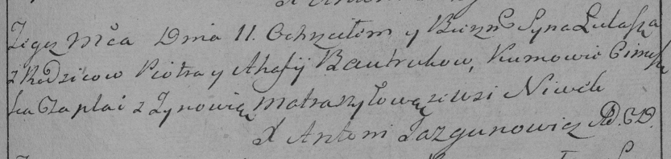

**Бавтрук Тадей Пятрусёв (Bautruk Thadeusz)**

27 августа 1788 г -- крещение (НИАБ 136-13-894, лист 5, №45/1788-р
(ориг)).

**НИАБ 136-13-894:** Лист 5. **Метрическая запись №45/1788-р (ориг).**

{width="6.496527777777778in"
height="0.8093000874890639in"}

Дедиловичская Покровская церковь. 27 августа 1788 года. Метрическая
запись о крещении.

Bautruk Thadeusz -- сын родителей с деревни Нивки.

Bautruk Piatruś -- отец.

Bautrukowa Ahafija -- мать.

Ciaplak Cimoszka - кум.

Ciunczykowa? Zynowija - кума.

Jazgunowicz Antoni -- ксёндз.
