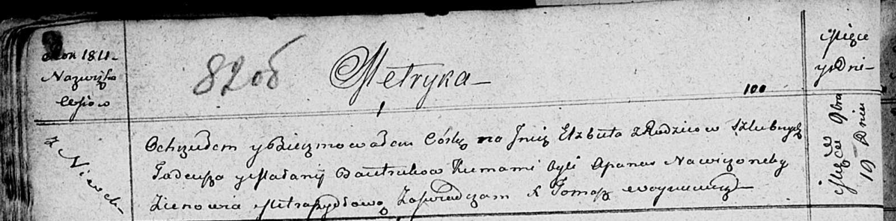

**Бавтрук Елисавета Тадеева (Bautrukowna Elżbieta)**

19 ноября 1811 г -- крещение (НИАБ 136-13-894, лист 82об, №58/1811-р
(ориг)).

**НИАБ 136-13-894:** Лист 82об. **Метрическая запись №58/1811-р
(ориг).**

Осовская Покровская церковь. 19 ноября 1811 года. Метрическая запись о
крещении.

Bautrukowna Elżbieta -- дочь родителей с деревни Нивки.

Bautruk Tadeusz -- отец.

Bautrukowa Malanija -- мать.

Nawiczonek Apanas -- кум.

Metraszyłowa Zienowia -- кума.

Woyniewicz Tomasz -- ксёндз.
