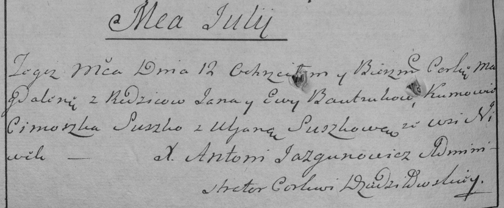
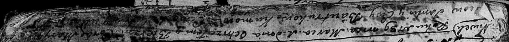
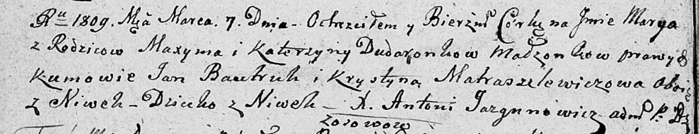

**Бавтрук Янка (Bautruk Janka, Jan)**

12 июля 1786 г -- крещение дочери Магдалены (РГИА 823-2-18, лист 231об,
№16/1786-р (коп)).

1 марта 1789 г -- крещение дочери Марыи (НИАБ 136-13-894, лист 2,
№1/1789-р (ориг)).

7 марта 1809 г -- крестный отец Марыи, дочери Дударёнков Максыма и
Катерыны с деревни Нивки (НИАБ 136-13-894, лист 73об, №8/1809-р (ориг)).

**РГИА 823-2-18:** Лист 231об. **Метрическая запись №16/1786-р (коп).**

Дедиловичская Покровская церковь. 12 июля 1786 года. Метрическая запись
о крещении.

Bautrukowna Magdalena -- дочь родителей с деревни Нивки.

Bautruk Jan -- отец.

Bautrukowa Ewa -- мать.

Suszko Cimoszka -- кум.

Suszkowa Uljana - кума.

Jazgunowicz Antoni -- ксёндз.

**НИАБ 136-13-894:** Лист 2. **Метрическая запись №1/1789-р (ориг).**

Дедиловичская Покровская церковь. 1 марта 1789 года. Метрическая запись
о крещении.

Bautrukowna Marya -- дочь родителей с деревни Нивки.

Bautruk Janka -- отец.

Bautrukowa Ewa -- мать.

? Cimachwey -- кум.

**НИАБ 136-13-894:** Лист 73об. **Метрическая запись №8/1809-р (ориг).**

Дедиловичская Покровская церковь. 7 марта 1809 года. Метрическая запись
о крещении.

Dudaronkowna Marya -- дочь родителей с деревни Нивки.

Dudaronek Maxym -- отец.

Dudaronkowa Katerzyna -- мать.

Bautruk Jan -- кум, с деревни Нивки.

Matraszelewiczowa Krystyna -- кума, с деревни Нивки.

Jazgunowicz Antoni -- ксёндз.
