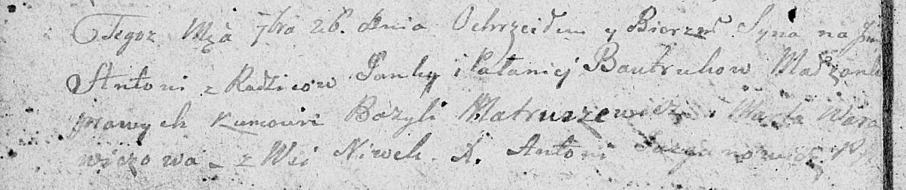

**Бавтрук Антон Янков (Bautruk Antoni)**

26 сентября 1809 г -- крещение (НИАБ 136-13-894, лист 75об, №48/1809-р
(ориг)).

**НИАБ 136-13-894:** Лист 75об. **Метрическая запись №48/1809-р
(ориг).**

Дедиловичская Покровская церковь. 26 сентября 1809 года. Метрическая
запись о крещении.

Bautruk Antoni -- сын родителей с деревни Нивки.

Bautruk Janka -- отец.

Bautrukowa Palanieja -- мать.

Matruszewicz Bazyli -- кум.

Warawiczowa Marta -- кума.

Jazgunowicz Antoni -- ксёндз.
