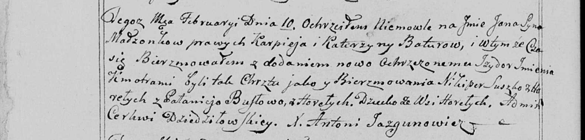

**Батура Катерына (Baturowa Katerzyna)**

10 февраля 1799 г -- крещение сына Яна Изыдора (НИАБ 136-13-894, лист
38, №6/1799-р (ориг)), (РГИА 823-2-18, лист 268, №6/1799-р (коп), НИАБ
136-13-938, лист 240об, №6/1799-р (коп)).

**НИАБ 136-13-894:** Лист 38. **Метрическая запись №6/1799-р (ориг).**

{width="6.496527777777778in"
height="0.901829615048119in"}

Дедиловичская Покровская церковь. 10 февраля 1799 года. Метрическая
запись о крещении.

Batura \[Jan\] Jzydor -- сын родителей с деревни Нивки.

Batura Karpiey -- отец.

Baturowa Katerzyna -- мать.

Suszko Nikiper -- кум с деревни Горелое.

Busłowa Pałanieja -- кума.

Jazgunowicz Antoni -- ксёндз, проводивший таинства, администратор
Дедиловичской церкви.

**РГИА 823-2-18:** Лист 268. **Метрическая запись №6/1799-р (коп).**

{width="6.496527777777778in"
height="1.2638888888888888in"}

Дедиловичская Покровская церковь. 10 февраля 1799 года. Метрическая
запись о крещении.

Baturo Jan -- сын родителей с деревни Горелое \[Нивки\].

Baturo Karpiey -- отец.

Baturowa Katarzyna -- мать.

Suszko Nikiper -- кум, с деревни Горелое \[Нивки\].

Busłowa Połonieja -- кума, с деревни Горелое \[Нивки\].

Jazgunowicz Antoni -- ксёндз.

**НИАБ 136-13-894:** 240об. **Метрическая запись №6/1799-р (коп).**

(См. тж. НИАБ 136-13-894, лист 38, №6/1799-р (ориг); РГИА 823-2-18, лист
268, №6/1799-р (коп))

{width="6.496527777777778in"
height="1.5618055555555554in"}

Дедиловичская Покровская церковь. 10 февраля 1799 года. Метрическая
запись о крещении.

Batura Jan Jzydor -- сын родителей с деревни Горелое \[Нивки\].

Batura Karpiey -- отец.

Baturowa Katerzyna -- мать.

Suszko Nikiper -- кум, с деревни Горелое.

Busłowa Pałanieja - кума, с деревни Горелое.

Jazgunowicz Antoni -- ксёндз.
