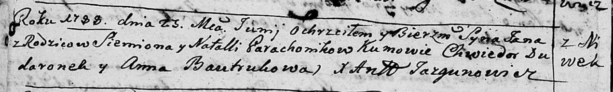

**Гороховик Семён (Garachowik Siemion)**

22 апреля 1787 г -- венчание с Натальей Бавтрук (НИАБ 136-13-894, лист
66, №4/1787-б (ориг)).

25 июня 1788 г -- крещение сына Яна (НИАБ 136-13-894, лист 4об,
№35/1788-р (ориг)).

**НИАБ 136-13-894:** Лист 66. **Метрическая запись №4/1787-б (ориг).**

Дедиловичская Покровская церковь. 22 апреля 1787 года. Метрическая
запись о венчании.

Garachowik Siemion -- жених.

Bautrukowna Natalla -- невеста с деревни \[Нивки\].

Bautruk Jan -- свидетель.

Lisowski Jhnat -- свидетель.

Jazgunowicz Antoni -- ксёндз.

**НИАБ 136-13-894:** Лист 4-об. **Метрическая запись №35/1788-р
(ориг).**

Дедиловичская Покровская церковь. 25 июня 1788 года. Метрическая запись
о крещении.

Garachowik Jan -- сын родителей с деревни Нивки.

Garachowik Siemion -- отец.

Garachowikowa Natalla -- мать.

Dudaronek Chwiedor - кум.

Bautrukowa Anna - кума.

Jazgunowicz Antoni -- ксёндз.
