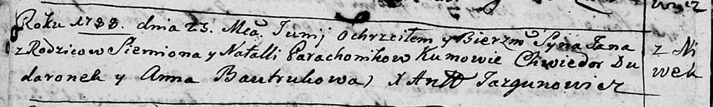

**Гороховик Ян Семёнов (Garachowik Jan)**

25 июня 1788 г -- крещение (НИАБ 136-13-894, лист 4об, №35/1788-р
(ориг)).

**НИАБ 136-13-894:** Лист 4-об. **Метрическая запись №35/1788-р
(ориг).**

{width="6.496527777777778in"
height="0.9816196412948381in"}

Дедиловичская Покровская церковь. 25 июня 1788 года. Метрическая запись
о крещении.

Garachowik Jan -- сын родителей с деревни Нивки.

Garachowik Siemion -- отец.

Garachowikowa Natalla -- мать.

Dudaronek Chwiedor - кум.

Bautrukowa Anna - кума.

Jazgunowicz Antoni -- ксёндз.
