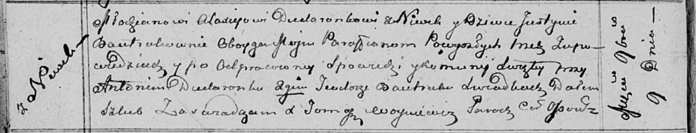

**Дударёнок Аляксей (Dudaronek Alaxiey)**

9 ноября 1813 г -- венчание с девкой Юстыной Бавтрук с деревни Нивки
(НИАБ 136-13-920, лист 20об, №26/1813-б (ориг)).

**НИАБ 136-13-920:** Лист 20об. **Метрическая запись №26/1813-б
(ориг).**

{width="6.496527777777778in"
height="1.2411056430446195in"}

Осовская Покровская церковь. 9 ноября 1813 года. Запись о венчании.

Dudaronek Alaxiey -- жених, молодой, парафии Осовской, с деревни Нивки.

Bautrukowna Justyna -- невеста, девка, парафии Осовской, с деревни
Нивки.

Dudaronek Antoni -- свидетель.

Bautruk Teodor -- свидетель.

Woyniewicz Tomasz -- ксёндз.
