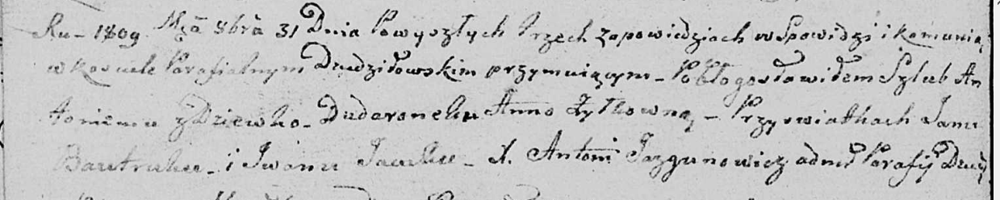
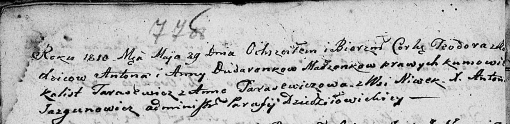

**Дударёнок Антон (Dudaronek Anton)**

31 октября 1809 г -- венчание с девкой Анной Жилко (НИАБ 136-13-920,
лист 15об, №14/1809-б (ориг)).

29 мая 1810 г -- крещение дочери Тодоры (НИАБ 136-13-894, лист 77об,
№17/1810-р (ориг)).

**НИАБ 136-13-920:** Лист 15об. **Метрическая запись №14/1809-б
(ориг).**

Дедиловичская Покровская церковь. 31 октября 1809 года. Метрическая
запись о венчании.

Dudaronek Antoni -- жених, с деревни \[Нивки\].

Żyłkowna Anna -- невеста, девка.

Bautruk Jan -- свидетель.

Jacuk Jwan -- свидетель.

Jazgunowicz Antoni -- ксёндз.

**НИАБ 136-13-894:** Лист 77об. **Метрическая запись №17/1810-р
(ориг).**

Дедиловичская Покровская церковь. 29 мая 1810 года. Метрическая запись о
крещении.

Dudaronkowna Teodora -- дочь родителей из деревни Нивки.

Dudaronek Anton -- отец.

Dudaronkowa Anna -- мать.

Tarasewicz Kalist -- кум.

Tarasewiczowa Anna -- кума.

Jazgunowicz Antoni -- ксёндз.
