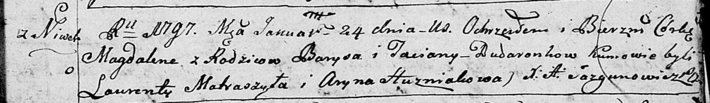

**Дударёнок Барыс (Dudaronek Barys)**

24 января 1796 г -- крещение дочери Магдалены (НИАБ 136-13-894, лист 32,
№9/1797-р (ориг)).

**НИАБ 136-13-894:** Лист 32. **Метрическая запись №9/1797-р (ориг).**

{width="6.496527777777778in"
height="0.9527887139107611in"}

Дедиловичская Покровская церковь. 24 января 1797 года. Метрическая
запись о крещении.

Dudaronkowna Magdalena -- дочь родителей с деревни Нивки.

Dudaronek Barys -- отец.

Dudaronkowa Taciana -- мать.

Matraszyła Łaurenty - кум.

Huzniakowa Aryna - кума.

Jazgunowicz Antoni -- ксёндз.
