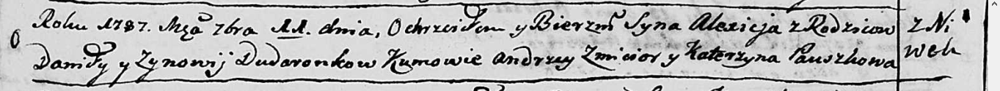

**Дударёнок Алексей Данилов (Dudaronek Alexiey)**

11 сентября 1787 г -- крещение (НИАБ 136-13-894, лист 2об, №44/1787-р
(ориг)).

**НИАБ 136-13-894:** Лист 2об. **Метрическая запись №44/1787-р (ориг).**

{width="6.496527777777778in"
height="0.5960793963254594in"}

Дедиловичская Покровская церковь. 11 сентября 1787 года. Метрическая
запись о крещении.

Dudaronek Alexiej - сын родителей с деревни Нивки.

Dudaronek Daniła -- отец.

Dudaronkowa Zynowija -- мать.

Zmicior Andrzej - кум.

Pauszkowa Katerzyna - кума.
