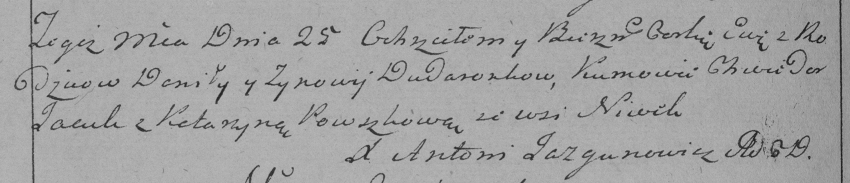

**Дударёнок Данила (Dudaronek Daniła)**

11 сентября 1787 г -- крещение сына Алексея (НИАБ 136-13-894, лист 2об,
№44/1787-р (ориг)).

25 августа 1790 г -- крещение дочери Евы (НИАБ 136-13-894, лист 10об,
№59/1790-р (ориг)), (РГИА 823-2-18, лист 240об, №23/1790-р (коп)).

17 октября 1792 г -- крещение сына Якова (НИАБ 136-13-894, лист 17,
№66/1792-р (ориг)).

27 августа 1795 г -- крещение сына Павла (НИАБ 136-13-894, лист 25,
№31/1795-р (ориг)), (РГИА 823-2-18, лист 253, №24/1795-р (коп)).

28 апреля 1797 г -- крещение дочери Ксени (НИАБ 136-13-894, лист 33,
№25/1797-р (ориг)).

**НИАБ 136-13-894:** Лист 2об. **Метрическая запись №44/1787-р (ориг).**

{width="6.496527777777778in"
height="0.5960793963254594in"}

Дедиловичская Покровская церковь. 11 сентября 1787 года. Метрическая
запись о крещении.

Dudaronek Alexiej - сын родителей с деревни Нивки.

Dudaronek Daniła -- отец.

Dudaronkowa Zynowija -- мать.

Zmicior Andrzej - кум.

Pauszkowa Katerzyna - кума.

**НИАБ 136-13-894:** Лист 10об. **Метрическая запись №59/1790-р
(ориг).**

{width="6.496527777777778in"
height="0.9474245406824147in"}

Дедиловичская Покровская церковь. 25 августа 1790 года. Метрическая
запись о крещении.

Dudaronkowna Ewa -- дочь родителей с деревни Нивки.

Dudaronek Daniła -- отец.

Dudaronkowa Zynowija -- мать.

Jacuk Chwiedor - кум.

Pauszycha Katerzyna - кума.

Jazgunowicz Antoni -- ксёндз.

**РГИА 823-2-18:** Лист 240об. **Метрическая запись №23/1790-р (коп).**

{width="6.496527777777778in"
height="1.398611111111111in"}

Дедиловичская Покровская церковь. 25 августа 1790 года. Метрическая
запись о крещении.

Dudaronkowna Ewa -- дочь родителей с деревни Нивки.

Dudaronek Daniło -- отец.

Dudaronkowa Zynowija -- мать.

Jacuk Chwiedor -- кум.

Pauszkowa Katarzyna - кума.

Jazgunowicz Antoni -- ксёндз.

**НИАБ 136-13-894:** Лист 17. **Метрическая запись №66/1792-р (ориг).**

{width="6.496527777777778in"
height="0.9628455818022748in"}

Дедиловичская Покровская церковь. 17 октября 1792 года. Метрическая
запись о крещении.

Dudaronek Jakow -- сын родителей с деревни Нивки.

Dudaronek Daniła -- отец.

Dudaronkowa Zynowija -- мать.

Zmicior Andrzey - кум.

Pauszkowa Katerzyna - кума.

Jazgunowicz Antoni -- ксёндз.

**НИАБ 136-13-894:** Лист 25. **Метрическая запись №31/1795-р (ориг).**

{width="6.496527777777778in"
height="1.0339195100612424in"}

Дедиловичская Покровская церковь. 27 августа 1795 года. Метрическая
запись о крещении.

Dudaronek Paweł -- сын родителей с деревни Нивки.

Dudaronek Danila -- отец.

Dudaronkowa Zynowija -- мать.

Dudaronek Chwiedor - кум.

Pauszkowa Katerzyna - кума.

Jazgunowicz Antoni -- ксёндз.

**РГИА 823-2-18:** Лист 253. **Метрическая запись №24/1795-р (коп).**

{width="6.496527777777778in"
height="1.5430555555555556in"}

Дедиловичская Покровская церковь. 27 августа 1795 года. Метрическая
запись о крещении.

Dudaronek Paweł -- сын родителей с деревни Нивки.

Dudaronek Daniło -- отец.

Dudaronkowa Zynowija -- мать.

Dudaronek Chwiedor -- кум.

Pauszkowa Katarzyna -- кума.

Jazgunowicz Antoni -- ксёндз.

**НИАБ 136-13-894:** Лист 33. **Метрическая запись №25/1797-р (ориг).**

{width="6.496527777777778in"
height="0.772422353455818in"}

Дедиловичская Покровская церковь. 28 апреля 1797 года. Метрическая
запись о крещении.

Dudaronkowna Xienia -- дочь родителей с деревни Нивки.

Dudaronek Daniła -- отец.

Dudaronkowa Zynowija -- мать.

Jacuk Chwiedor - кум.

Pauszkowa Katerzyna - кума.

Jazgunowicz Antoni -- ксёндз.
