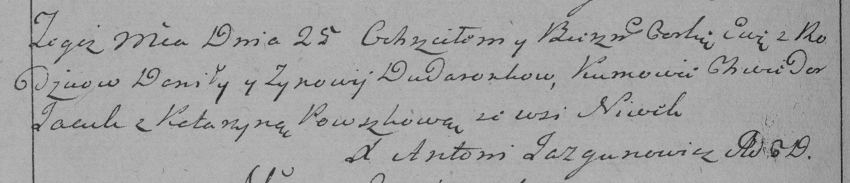

**Дударёнок Ева Данилова (Dudaronkowna Ewa)**

25 августа 1790 г -- крещение (НИАБ 136-13-894, лист 10об, №59/1790-р
(ориг)), (РГИА 823-2-18, лист 240об, №23/1790-р (коп)).

**НИАБ 136-13-894:** Лист 10об. **Метрическая запись №59/1790-р
(ориг).**

{width="6.496527777777778in"
height="0.9474245406824147in"}

Дедиловичская Покровская церковь. 25 августа 1790 года. Метрическая
запись о крещении.

Dudaronkowna Ewa -- дочь родителей с деревни Нивки.

Dudaronek Daniła -- отец.

Dudaronkowa Zynowija -- мать.

Jacuk Chwiedor - кум.

Pauszycha Katerzyna - кума.

Jazgunowicz Antoni -- ксёндз.

**РГИА 823-2-18:** Лист 240об. **Метрическая запись №23/1790-р (коп).**

{width="6.496527777777778in"
height="1.398611111111111in"}

Дедиловичская Покровская церковь. 25 августа 1790 года. Метрическая
запись о крещении.

Dudaronkowna Ewa -- дочь родителей с деревни Нивки.

Dudaronek Daniło -- отец.

Dudaronkowa Zynowija -- мать.

Jacuk Chwiedor -- кум.

Pauszkowa Katarzyna - кума.

Jazgunowicz Antoni -- ксёндз.
