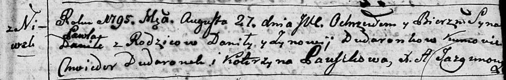
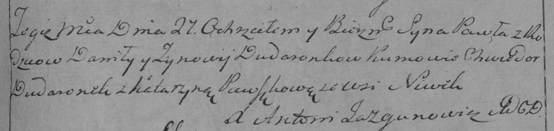

**Дударёнок Павел Данилов (Dudaronek Paweł)**

27 августа 1795 г -- крещение (НИАБ 136-13-894, лист 25, №31/1795-р
(ориг)), (РГИА 823-2-18, лист 253, №24/1795-р (коп)).

**НИАБ 136-13-894:** Лист 25. **Метрическая запись №31/1795-р (ориг).**

Дедиловичская Покровская церковь. 27 августа 1795 года. Метрическая
запись о крещении.

Dudaronek Paweł -- сын родителей с деревни Нивки.

Dudaronek Danila -- отец.

Dudaronkowa Zynowija -- мать.

Dudaronek Chwiedor - кум.

Pauszkowa Katerzyna - кума.

Jazgunowicz Antoni -- ксёндз.

**РГИА 823-2-18:** Лист 253. **Метрическая запись №24/1795-р (коп).**

Дедиловичская Покровская церковь. 27 августа 1795 года. Метрическая
запись о крещении.

Dudaronek Paweł -- сын родителей с деревни Нивки.

Dudaronek Daniło -- отец.

Dudaronkowa Zynowija -- мать.

Dudaronek Chwiedor -- кум.

Pauszkowa Katarzyna -- кума.

Jazgunowicz Antoni -- ксёндз.
