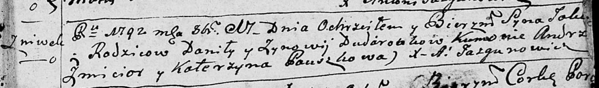

**Дударёнок Яков Данилов (Dudaronek Jakow)**

17 октября 1792 г -- крещение (НИАБ 136-13-894, лист 17, №66/1792-р
(ориг)).

**НИАБ 136-13-894:** Лист 17. **Метрическая запись №66/1792-р (ориг).**

{width="6.496527777777778in"
height="0.9628455818022748in"}

Дедиловичская Покровская церковь. 17 октября 1792 года. Метрическая
запись о крещении.

Dudaronek Jakow -- сын родителей с деревни Нивки.

Dudaronek Daniła -- отец.

Dudaronkowa Zynowija -- мать.

Zmicior Andrzey - кум.

Pauszkowa Katerzyna - кума.

Jazgunowicz Antoni -- ксёндз.
