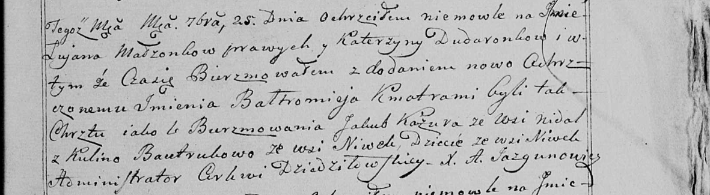

**Дударёнок (Скакун) Катерина (Dudaronkowa Katerzyna z Skakunow)**

10 февраля 1796 г -- венчание с Демьяном Дударёнком с деревни Нивки
(НИАБ 136-13-920, лист 3, №7/1796-б (ориг)).

23 августа 1797 г -- крещение дочери Параски (НИАБ 136-13-894, лист 34,
№53/1797-р (ориг)).

25 сентября 1799 г -- крещение сына Лукьяна Балтромея (НИАБ 136-13-894,
лист 39об, №37/1799-р (ориг), РГИА 823-2-18, лист 272, №36/1799-р (коп),
НИАБ 136-13-938, лист 244, №35/1799-р (коп)).

**НИАБ 136-13-920:** Лист 3. **Метрическая запись №7/1796-б (ориг).**

Дедиловичская Покровская церковь. 10 февраля 1796 года. Метрическая
запись о венчании.

Dudaronek Dziemjan -- жених, деревня Нивки.

Skakunowna Katerzyna -- невеста, деревня Осовo.

Dyszlonek Hryhor -- свидетель, деревня Нивки.

Łukaszewicz Leon -- свидетель, деревня Разлитье.

Jazgunowicz Antoni -- ксёндз.

**НИАБ 136-13-894:** Лист 34. **Метрическая запись №53/1797-р (ориг).**

Дедиловичская Покровская церковь. 23 августа 1797 года. Метрическая
запись о крещении.

Dudaronkowna Paraska -- дочь родителей с деревни Нивки.

Dudaronek Dziemjan -- отец.

Dudaronkowa Katerzyna -- мать.

Kuzura Jakow - кум.

Bautrukowa Kulina - кума.

Jazgunowicz Antoni -- ксёндз.

**НИАБ 136-13-894:** Лист 39об. **Метрическая запись №37/1799-р
(ориг).**

Дедиловичская Покровская церковь. 25 сентября 1799 года. Метрическая
запись о крещении.

Dudaronek Łukjan Bałtromiey -- сын родителей с деревни Нивки.

Dudaronek Dziemjan -- отец.

Dudaronkowa Katerzyna -- мать.

Kazura Jakub -- кум с деревни Недаль.

Bautrukowa Kulina -- кума с деревни Нивки.

Jazgunowicz Antoni -- ксёндз.

**РГИА 823-2-18:** Лист 272. **Метрическая запись №36/1799-р (коп).**

Дедиловичская Покровская церковь. 25 сентября 1799 года. Метрическая
запись о крещении.

Dudaronek Łukjan -- сын родителей с деревни Нивки.

Dudaronek Dziemjan -- отец.

Dudaronkowa Katerzyna -- мать.

Kaziura Jakub -- кум, с деревни Недаль.

Bautrukowa Kulina -- кума, с деревни Нивки.

Jazgunowicz Antoni -- ксёндз.

**НИАБ 136-13-938:** Лист 244. **Метрическая запись №35/1799-р (коп).**

(См. тж. НИАБ 136-13-894, лист 39об, №37/1799-р (ориг); РГИА 823-2-18,
лист 271, №33/1799-р (коп))

Дедиловичская Покровская церковь. 25 сентября 1799 года. Метрическая
запись о крещении.

Dudaronek Łukjan Baltromiey -- сын родителей с деревни Нивки.

Dudaronek \[Dziemjan\] -- отец.

Dudaronkowa Katerzyna -- мать.

Kazura Jakub -- кум, с деревни Недаль.

Bautrukowa Kulina - кума, с деревни Нивки.

Jazgunowicz Antoni -- ксёндз.
