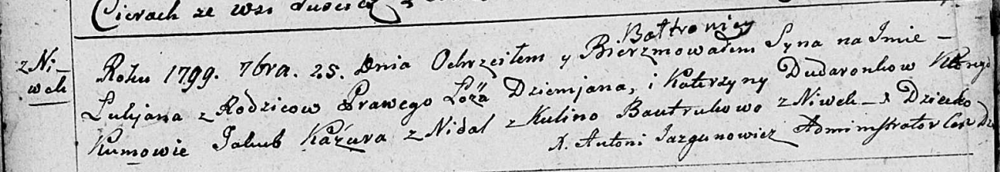
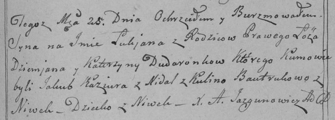

**Дударёнок Лукьян Демьянов (Dudaronek Łukjan Bałtromiey)**

25 сентября 1799 г -- крещение (НИАБ 136-13-894, лист 39об, №37/1799-р
(ориг), РГИА 823-2-18, лист 272, №36/1799-р (коп), НИАБ 136-13-938, лист
244, №35/1799-р (коп)).

**НИАБ 136-13-894:** Лист 39об. **Метрическая запись №37/1799-р
(ориг).**

Дедиловичская Покровская церковь. 25 сентября 1799 года. Метрическая
запись о крещении.

Dudaronek Łukjan Bałtromiey -- сын родителей с деревни Нивки.

Dudaronek Dziemjan -- отец.

Dudaronkowa Katerzyna -- мать.

Kazura Jakub -- кум с деревни Недаль.

Bautrukowa Kulina -- кума с деревни Нивки.

Jazgunowicz Antoni -- ксёндз.

**РГИА 823-2-18:** Лист 272. **Метрическая запись №36/1799-р (коп).**

Дедиловичская Покровская церковь. 25 сентября 1799 года. Метрическая
запись о крещении.

Dudaronek Łukjan -- сын родителей с деревни Нивки.

Dudaronek Dziemjan -- отец.

Dudaronkowa Katerzyna -- мать.

Kaziura Jakub -- кум, с деревни Недаль.

Bautrukowa Kulina -- кума, с деревни Нивки.

Jazgunowicz Antoni -- ксёндз.

**НИАБ 136-13-938:** Лист 244. **Метрическая запись №35/1799-р (коп).**

(См. тж. НИАБ 136-13-894, лист 39об, №37/1799-р (ориг); РГИА 823-2-18,
лист 271, №33/1799-р (коп))

Дедиловичская Покровская церковь. 25 сентября 1799 года. Метрическая
запись о крещении.

Dudaronek Łukjan Baltromiey -- сын родителей с деревни Нивки.

Dudaronek \[Dziemjan\] -- отец.

Dudaronkowa Katerzyna -- мать.

Kazura Jakub -- кум, с деревни Недаль.

Bautrukowa Kulina - кума, с деревни Нивки.

Jazgunowicz Antoni -- ксёндз.
