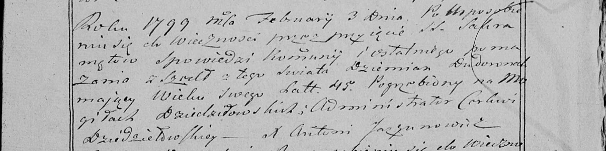

**Дударёнок Демьян (Dudaronek Dziemjan)**

3 февраля 1799 г -- отпевание, умер в возрасте 45 лет (родился около
1754 г) (НИАБ 136-13-919, лист 8об, №3/1799-у (ориг), НИАБ 136-13-938,
лист 250, №3/1799-у (коп)).

**НИАБ 136-13-919:** Лист 8об. **Метрическая запись №3/1799-у (ориг).**

{width="6.496527777777778in"
height="1.0416666666666667in"}

Дедиловичская Покровская церковь. 3 февраля 1799 года. Метрическая
запись об отпевании.

Dudaronek Dziemjan -- умерший, 45 лет, с деревни Нивки, похоронен на
кладбище деревни Клинники.

Jazgunowicz Antoni -- ксёндз.

**НИАБ 136-13-938:** Лист 250. **Метрическая запись №3/1799-у (коп).**

(См. тж. НИАБ 136-13-919, Лист 8об. Метрическая запись №3/1799-у (ориг))

{width="6.496527777777778in"
height="1.6284722222222223in"}

Дедиловичская Покровская церковь. 3 февраля 1799 года. Метрическая
запись об отпевании.

Dudaronek Dziemian -- умерший, 45 лет, с деревни \[Нивки\], похоронен на
кладбище деревни Дедиловичи.

Jazgunowicz Antoni -- ксёндз.
