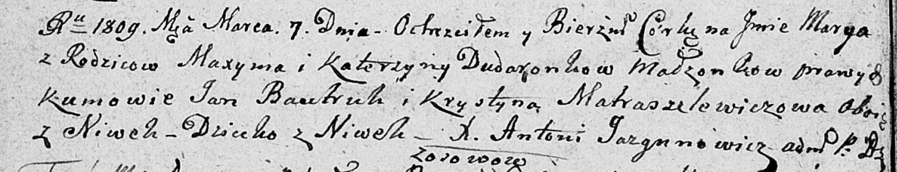

**Дударёнок Максым (Dudaronok Maxym)**

7 марта 1809 г -- крещение дочери Марыи (НИАБ 136-13-894, лист 73об,
№8/1809-р (ориг)).

**НИАБ 136-13-894:** Лист 73об. **Метрическая запись №8/1809-р (ориг).**

Дедиловичская Покровская церковь. 7 марта 1809 года. Метрическая запись
о крещении.

Dudaronkowna Marya -- дочь родителей с деревни Нивки.

Dudaronek Maxym -- отец.

Dudaronkowa Katerzyna -- мать.

Bautruk Jan -- кум, с деревни Нивки.

Matraszelewiczowa Krystyna -- кума, с деревни Нивки.

Jazgunowicz Antoni -- ксёндз.
