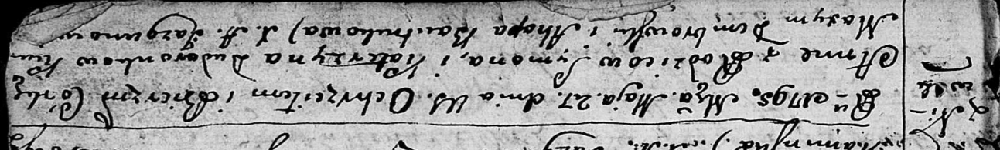
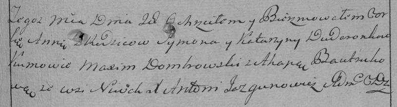

**Дударёнок Анна Сымонова (Dudaronkowna Anna)**

27 мая 1795 г -- крещение (НИАБ 136-13-894, лист 24, №15/1795-р (ориг)),
(РГИА 823-2-18, лист 252, №12/1795-р (коп)).

**НИАБ 136-13-894:** Лист 24. **Метрическая запись №15/1795-р (ориг).**

Дедиловичская Покровская церковь. 27 мая 1795 года. Метрическая запись о
крещении.

Dudaronkowna Anna -- дочь родителей с деревни Нивки.

Dudaronоk Symon -- отец.

Dudaronkowa Katerzyna -- мать.

Dembrowski Maxym - кум.

Bautrukowa Ahapa - кума.

Jazgunowicz Antoni -- ксёндз.

**РГИА 823-2-18:** Лист 252. **Метрическая запись №12/1795-р (коп).**

Дедиловичская Покровская церковь. \[27\] мая 1795 года. Метрическая
запись о крещении.

Dudaronkowna Anna -- дочь родителей с деревни Нивки.

Dudaronek Symon -- отец.

Dudaronkowa Katarzyna -- мать.

Dombrowski Maxim -- кум.

Bautrukowa Ahapa -- кума.

Jazgunowicz Antoni -- ксёндз.
