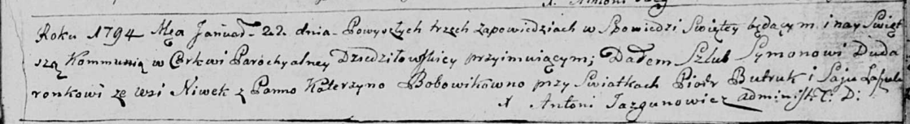
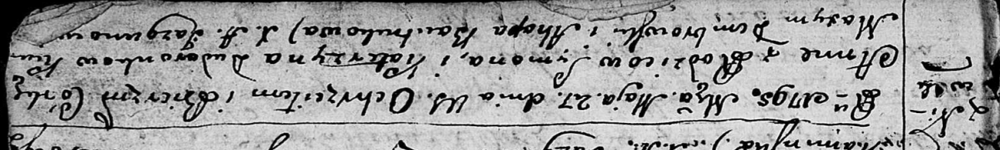
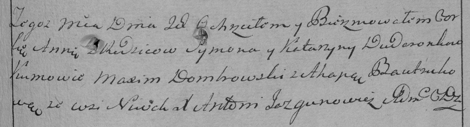
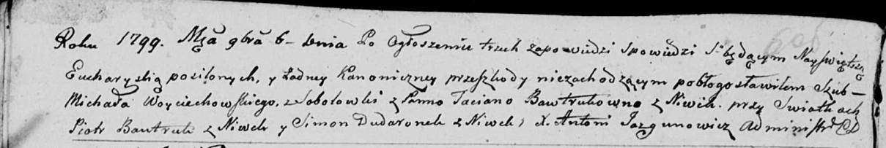

**Дударёнок Сымон (Dudaronok Symon)**

22 января 1794 г -- венчание с Катерыной Бобовик (НИАБ 136-13-920, лист
1, №2/1794-б (ориг)).

27 мая 1795 г -- крещение дочери Анны (НИАБ 136-13-894, лист 24,
№15/1795-р (ориг)), (РГИА 823-2-18, лист 252, №12/1795-р (коп)).

6 ноября 1799 г -- свидетель венчания Войцеховского Михала с деревни
Соболевка с Бавтрук Татьяной с деревни Нивки (НИАБ 136-13-920, лист 6об,
№4/1799-б (ориг)).

**НИАБ 136-13-920:** Лист 1. **Метрическая запись №2/1794-б (ориг).**

Дедиловичская Покровская церковь. 22 января 1794 года. Метрическая
запись о венчании.

Dudaronek Symon -- жених, деревня Нивки.

Bobowikowna Katerzyna -- невеста.

Butruk Piotr -- свидетель.

Łaszuk Jsay -- свидетель.

Jazgunowicz Antoni -- ксёндз.

**НИАБ 136-13-894:** Лист 24. **Метрическая запись №15/1795-р (ориг).**

Дедиловичская Покровская церковь. 27 мая 1795 года. Метрическая запись о
крещении.

Dudaronkowna Anna -- дочь родителей с деревни Нивки.

Dudaronоk Symon -- отец.

Dudaronkowa Katerzyna -- мать.

Dembrowski Maxym - кум.

Bautrukowa Ahapa - кума.

Jazgunowicz Antoni -- ксёндз.

**РГИА 823-2-18:** Лист 252. **Метрическая запись №12/1795-р (коп).**

Дедиловичская Покровская церковь. \[27\] мая 1795 года. Метрическая
запись о крещении.

Dudaronkowna Anna -- дочь родителей с деревни Нивки.

Dudaronek Symon -- отец.

Dudaronkowa Katarzyna -- мать.

Dombrowski Maxim -- кум.

Bautrukowa Ahapa -- кума.

Jazgunowicz Antoni -- ксёндз.

**НИАБ 136-13-920:** Лист 6об. **Метрическая запись №4/1799-б (ориг).**

Дедиловичская Покровская церковь. 6 ноября 1799 года. Метрическая запись
о венчании.

Woyciechowski Michał -- жених, деревня Соболевка.

Bautrukowna Taciana -- невеста, деревня Нивки.

Bautruk Piotr -- свидетель, деревня Нивки.

Dudaronek Simon -- свидетель, деревня Нивки.

Jazgunowicz Antoni -- ксёндз.
