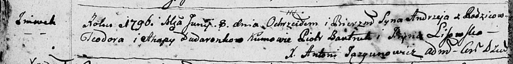

**Дударёнок Андрей Хведоров (Dudaronok Andrzey)**

8 июня 1796 г -- крещение (НИАБ 136-13-894, лист 29об, №59/1796-р
(ориг)), (РГИА 823-2-18, лист 256, №31/1796-р (коп)).

**НИАБ 136-13-894:** Лист 29-об. **Метрическая запись №59/1796-р
(ориг).**

Дедиловичская Покровская церковь. 8 июня 1796 года. Метрическая запись о
крещении.

Dudaronok Andrzey -- сын родителей с деревни Нивки.

Dudaronok Teodor -- отец.

Dudaronkowa Ahapa -- мать.

Bautruk Piotr - кум.

Lisowska Jryna - кума.

Jazgunowicz Antoni -- ксёндз.

**РГИА 823-2-18:** Лист 256. **Метрическая запись №31/1796-р (коп).**

Дедиловичская Покровская церковь. 8 июня 1796 года. Метрическая запись о
крещении.

Dudaronek Andrzey -- сын родителей с деревни Нивки.

Dudaronek Teodor -- отец.

Dudaronkowa Ahapa -- мать.

Bautruk Piotr -- кум.

Lisowska Jryna -- кума.

Jazgunowicz Antoni -- ксёндз.
