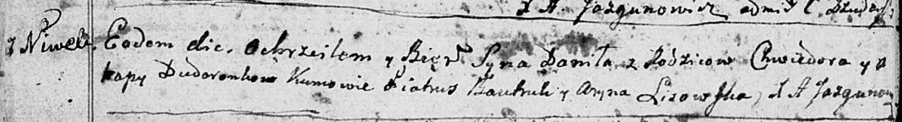
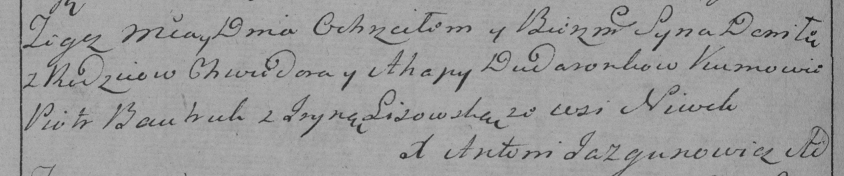

**Дударёнок Данила Хведоров (Dudaronok Daniła)**

21 декабря 1791 г -- крещение (НИАБ 136-13-894, лист 14об, №67/1791-р
(ориг)), (РГИА 823-2-18, лист 243об, №35/1791-р (коп)).

**НИАБ 136-13-894:** Лист 14-об. **Метрическая запись №67/1791-р
(ориг).**

Дедиловичская Покровская церковь. 21 декабря 1791 года. Метрическая
запись о крещении.

Dudaronek Daniła -- сын родителей с деревни Нивки.

Dudaronek Chwiedor -- отец.

Dudaronkowa Ahapa -- мать.

Bautruk Piatruś - кум.

Lisowska Aryna - кума.

Jazgunowicz Antoni -- ксёндз.

**РГИА 823-2-18:** Лист 243об. **Метрическая запись №35/1791-р (коп).**

Дедиловичская Покровская церковь. 21 декабря 1791 года. Метрическая
запись о крещении.

Dudaronek Daniła -- сын родителей с деревни Нивки.

Dudaronek Chwiedor -- отец.

Dudaronkowa Ahapa-- мать.

Bautruk Piotr -- кум.

Lisowska Jryna - кума.

Jazgunowicz Antoni -- ксёндз.
